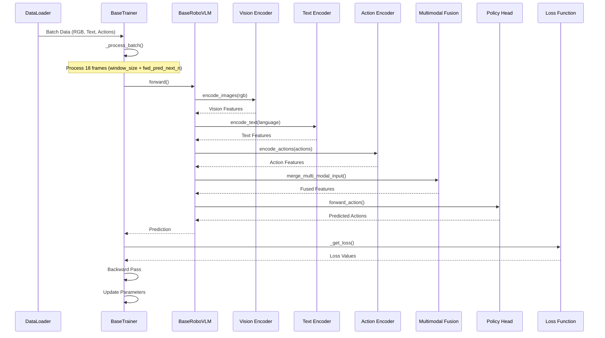
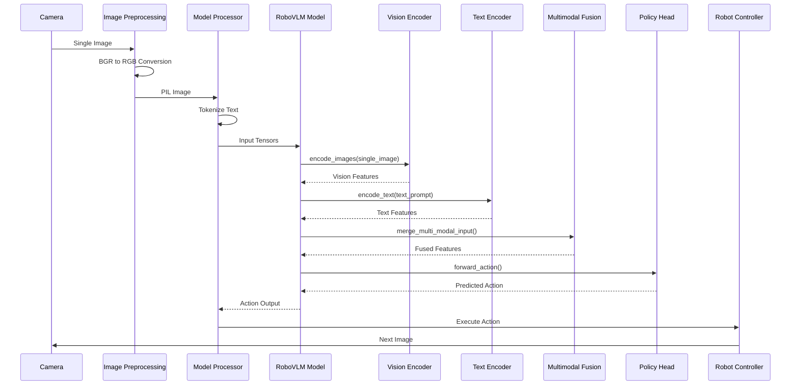
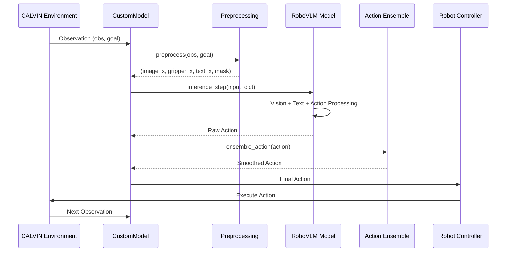

# 07_4 RoboVLMs Complete Sequence Diagram - GitHub Citations

## 📊 **RoboVLMs Complete Training & Inference Sequence Diagram**

### **7.4.1 Training Pipeline Sequence**
- **Source**: `RoboVLMs/robovlms/train/base_trainer.py:565-625`  # GitHub 코드에서 확인된 훈련 파이프라인
- **Training Step Process**:  # 훈련 단계 과정
  ```python
  def training_step(self, batch, batch_idx):
      """훈련 단계 (배치 처리)"""
      # 배치 데이터 처리
      (rgb, hand_rgb, attention_mask, language, text_mask, 
       fwd_rgb_chunck, fwd_hand_rgb_chunck, arm_action, gripper_action,
       arm_action_chunck, gripper_action_chunck, chunck_mask, fwd_mask,
       instr_and_action_ids, instr_and_action_labels, instr_and_action_mask,
       raw_text, rel_state, data_source) = self._process_batch(batch)
      
      # 모델 순전파 (18프레임 배치 처리)
      prediction = self.model.forward(
          rgb, language, attention_mask=text_mask,
          action_labels=(arm_action_chunck, gripper_action_chunck),
          action_mask=chunck_mask, vision_gripper=hand_rgb,
          fwd_rgb_labels=fwd_rgb_chunck, fwd_hand_rgb_labels=fwd_hand_rgb_chunck,
          fwd_mask=fwd_mask, instr_and_action_ids=instr_and_action_ids,
          instr_and_action_labels=instr_and_action_labels,
          instr_and_action_mask=instr_and_action_mask,
          raw_text=raw_text, data_source=data_source, rel_state=rel_state
      )
      
      # 손실 계산
      output = self._get_loss(prediction)
  ```

### **7.4.2 Inference Pipeline Sequence**
- **Source**: `RoboVLMs/vla_test/standalone_vla_test.py:87-124`  # GitHub 코드에서 확인된 추론 파이프라인
- **Inference Step Process**:  # 추론 단계 과정
  ```python
  def infer_from_image_and_text(self, image: np.ndarray, text_prompt: str) -> str:
      """단일 이미지 순차 추론"""
      # 1. 이미지 전처리
      if len(image.shape) == 3 and image.shape[2] == 3:
          rgb_image = cv2.cvtColor(image, cv2.COLOR_BGR2RGB)  # BGR → RGB 변환
      else:
          rgb_image = image
      pil_image = PilImage.fromarray(rgb_image)              # PIL 이미지로 변환
      
      # 2. 모델 입력 준비 (단일 이미지)
      inputs = self.processor(
          images=pil_image, text=text_prompt, return_tensors="pt"
      ).to(self.device)
      
      # 3. 모델 추론 실행 (단일 이미지 순차 처리)
      with torch.no_grad():
          outputs = self.model.generate(**inputs, max_new_tokens=self.max_new_tokens, do_sample=False)
          result = self.processor.decode(outputs[0], skip_special_tokens=True)
      
      return result
  ```

### **7.4.3 CALVIN Step Function Sequence**
- **Source**: `RoboVLMs/eval/calvin/model_wrapper.py:318-378`  # GitHub 코드에서 확인된 CALVIN Step 함수
- **Step Function Process**:  # Step 함수 과정
  ```python
  def step(self, obs, goal):
      """CALVIN Step 함수 (단일 이미지 순차 처리)"""
      # 1. 관찰 전처리
      image_x, gripper_x, text_x, mask = self.preprocess(obs, goal, self.action_space)
      
      # 2. 입력 딕셔너리 구성 (단일 이미지)
      input_dict = {
          "rgb": image_x,        # 단일 이미지
          "hand_rgb": gripper_x, # 단일 그리퍼 이미지
          "text": text_x,        # 텍스트
          "text_mask": mask      # 텍스트 마스크
      }
      
      # 3. 모델 추론 (단일 이미지 순차 처리)
      with torch.no_grad():
          action = self.policy.inference_step(input_dict)["action"]
      
      # 4. 액션 후처리
      if self.action_space != "discrete":
          action = torch.cat([action[0], (torch.nn.functional.sigmoid(action[1]) > 0.5).float()], dim=-1)
      
      # 5. 액션 앙상블 적용
      action = self.ensemble_action(action)
      
      # 6. 최종 액션 반환
      if isinstance(action, torch.Tensor):
          action = action.squeeze()
          if action.ndim == 2:
              action = action[0]
      
      return action
  ```

## 🎯 **Complete Sequence Diagram**

### **7.4.4 Training Sequence Diagram**


### **7.4.5 Inference Sequence Diagram**


### **7.4.6 CALVIN Evaluation Sequence Diagram**


## 📊 **Technical Implementation Details**

### **7.4.7 Training vs Inference Key Differences**
- **Source**: `RoboVLMs/robovlms/train/base_trainer.py:345-395` vs `RoboVLMs/vla_test/standalone_vla_test.py:87-124`
- **Training**:  # 훈련
  - **Batch Processing**: Multiple sequences (18 frames)  # 여러 시퀀스 (18프레임)
  - **Data Chunking**: Sliding window approach  # 슬라이딩 윈도우 접근법
  - **Loss Calculation**: Backward pass with gradients  # 그래디언트를 사용한 역전파
- **Inference**:  # 추론
  - **Single Image**: One image at a time  # 한 번에 하나의 이미지
  - **Sequential Processing**: Step-by-step execution  # 단계별 실행
  - **Real-time**: No gradient computation  # 그래디언트 계산 없음

### **7.4.8 Data Flow Architecture**
- **Source**: `RoboVLMs/robovlms/model/README.md:58-104`  # GitHub README에서 확인된 데이터 플로우
- **Input Processing**:  # 입력 처리
  - **Vision**: Camera images → Vision Encoder → Vision Features  # 카메라 이미지 → 비전 인코더 → 비전 특징
  - **Language**: Text prompt → Text Encoder → Text Features  # 텍스트 프롬프트 → 텍스트 인코더 → 텍스트 특징
  - **Action**: Previous actions → Action Encoder → Action Features  # 이전 액션 → 액션 인코더 → 액션 특징
- **Fusion**: Multimodal features → Cross-attention → Fused representation  # 멀티모달 특징 → 크로스 어텐션 → 융합된 표현
- **Output**: Policy Head → Predicted actions → Robot execution  # 정책 헤드 → 예측된 액션 → 로봇 실행

### **7.4.9 Memory Management**
- **Source**: `RoboVLMs/robovlms/data/data_utils.py:249-270`  # GitHub 코드에서 확인된 메모리 관리
- **Training**:  # 훈련
  - **Window Size**: Controls historical context length  # 히스토리 컨텍스트 길이 제어
  - **Chunking**: Efficient processing of long sequences  # 긴 시퀀스의 효율적 처리
  - **Batch Processing**: Multiple sequences simultaneously  # 여러 시퀀스 동시 처리
- **Inference**:  # 추론
  - **Single Image**: Minimal memory footprint  # 최소 메모리 사용량
  - **Sequential**: One image at a time  # 한 번에 하나의 이미지
  - **Real-time**: Optimized for speed  # 속도 최적화

## 📁 **Supporting Files**
- `RoboVLMs/robovlms/train/base_trainer.py` (L565-625)  # 훈련 파이프라인
- `RoboVLMs/vla_test/standalone_vla_test.py` (L87-124)  # 추론 파이프라인
- `RoboVLMs/eval/calvin/model_wrapper.py` (L318-378)  # CALVIN Step 함수
- `RoboVLMs/robovlms/model/README.md` (L58-104)  # 모델 아키텍처
- `RoboVLMs/robovlms/data/data_utils.py` (L249-270)  # 데이터 유틸리티
- `RoboVLMs/robovlms/model/backbone/base_backbone.py` (L34-1495)  # 기본 백본 모델
