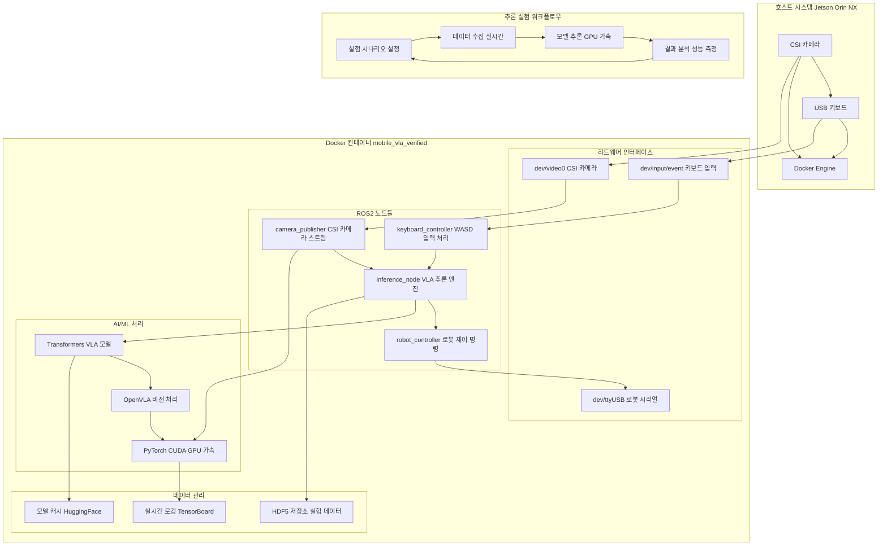
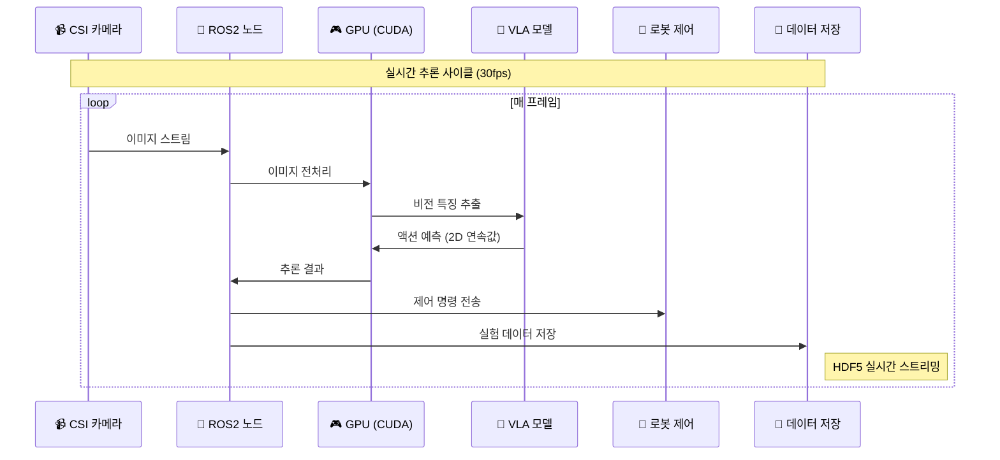
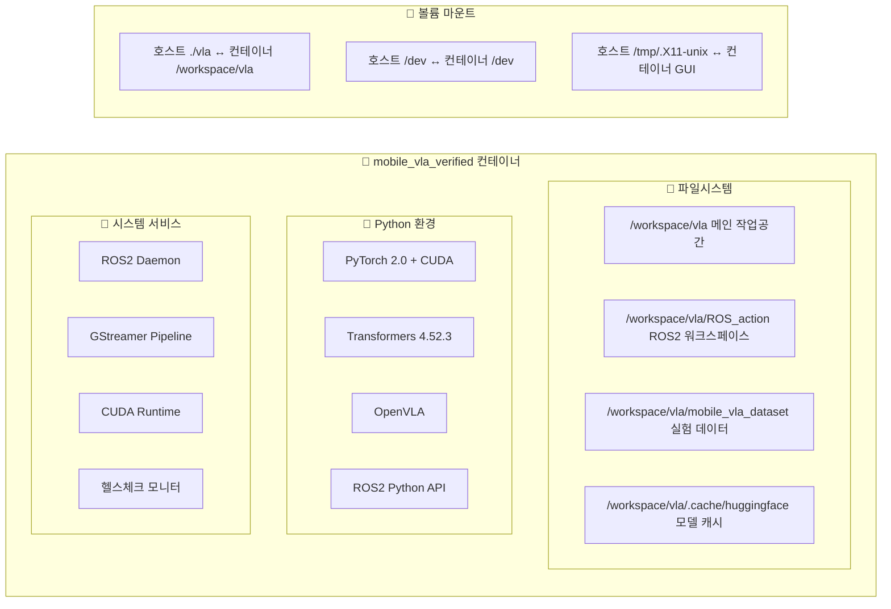
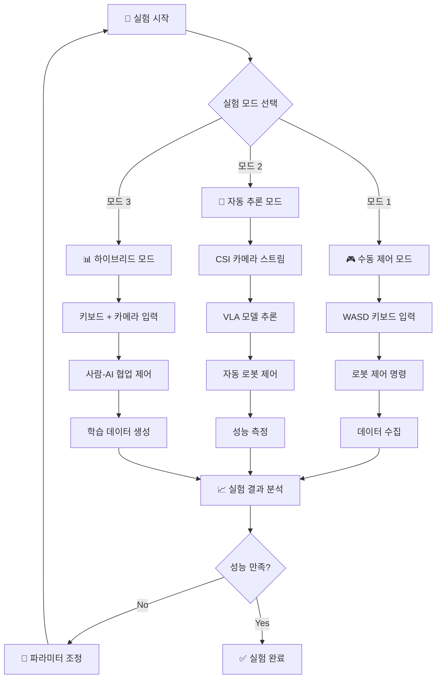
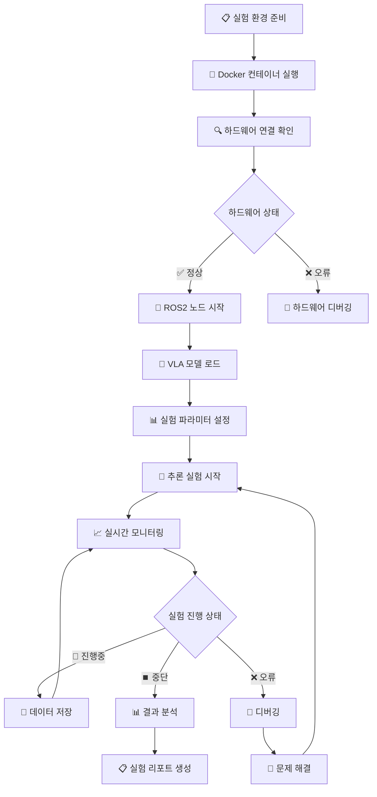
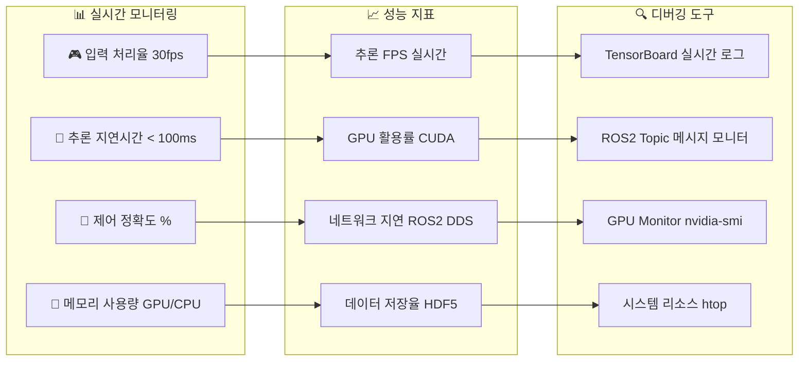
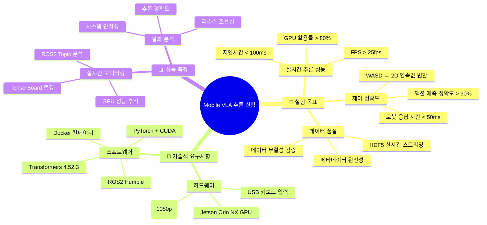
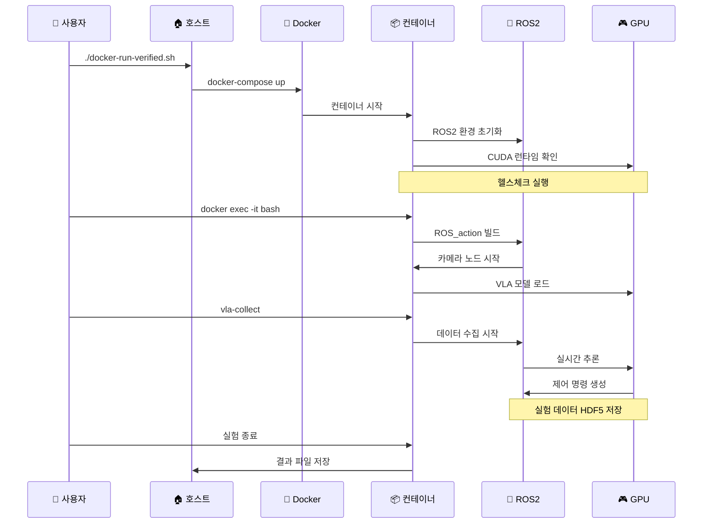

# 🚀 Mobile VLA 추론 실험 환경 구성

## 📊 전체 시스템 아키텍처



## 🔄 실시간 추론 파이프라인



## 🏗️ 도커 컨테이너 내부 구조



## 🎯 추론 실험 시나리오



## 🔧 실험 환경 설정 단계



## 📊 성능 모니터링 대시보드



## 🎯 실험 목표 및 성능 지표



## 🚀 실행 명령어 시퀀스



## 🔑 Hugging Face 설정

### 토큰 설정

```bash
# Hugging Face CLI 로그인
huggingface-cli login

# 토큰 입력 (프롬프트가 나타나면)
# Token: [YOUR_HUGGING_FACE_TOKEN_HERE]
```

### 환경 변수 설정

```bash
# Hugging Face 캐시 경로 설정
export HF_HOME="/workspace/vla/.cache/huggingface"
export TRANSFORMERS_CACHE="/workspace/vla/.cache/huggingface/transformers"

# 토큰 환경 변수 설정 (선택사항)
export HF_TOKEN="[YOUR_HUGGING_FACE_TOKEN_HERE]"
```

이 다이어그램들은 Mobile VLA 추론 실험 환경의 전체적인 구조와 워크플로우를 시각화하여, 실험 설계와 구현에 필요한 모든 구성요소와 관계를 명확하게 보여줍니다.
