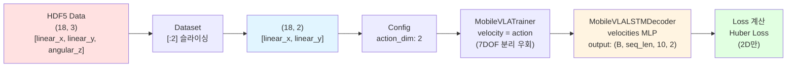
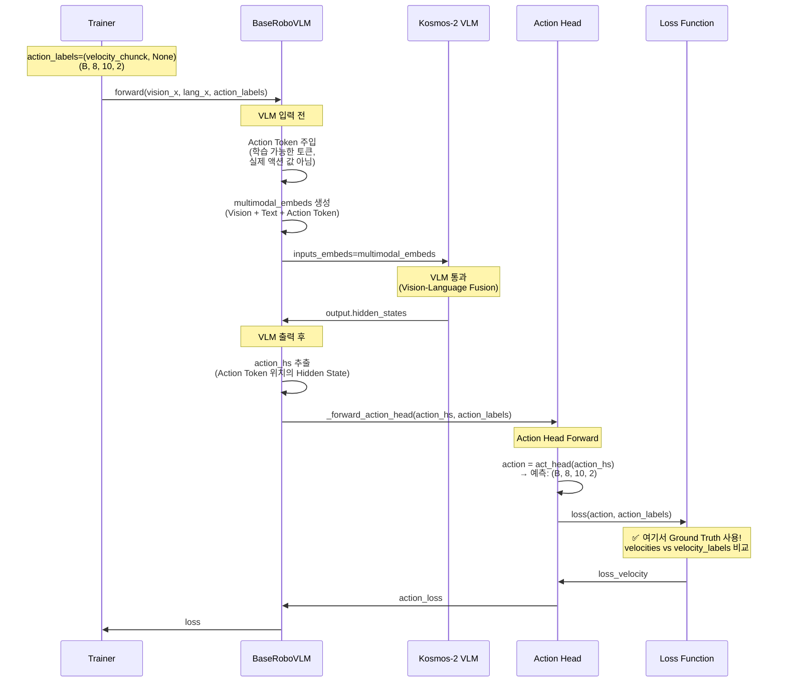
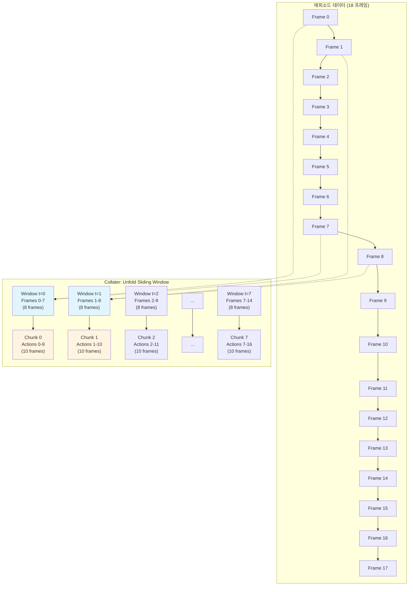
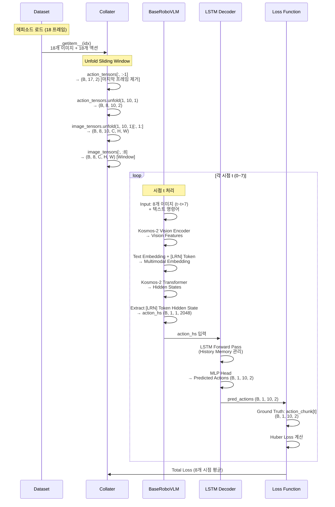
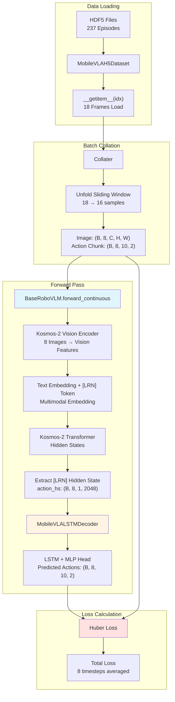

# 🔬 Mobile VLA 논문 실험 및 아키텍처 지식 베이스

## 1. 🏛️ 모델 아키텍처 및 데이터 플로우 (Architecture & Data Flow)

### 🔄 7DOF Manipulation vs 2DOF Navigation 비교 분석

**핵심 질문**: RoboVLMs는 원래 7DOF (6D arm + 1D gripper) manipulation을 위해 설계되었는데, Mobile VLA에서는 2DOF navigation으로 어떻게 변환되는가?

#### 📊 7DOF Manipulation 태스크 (원본 RoboVLMs)

**태스크**: CALVIN 데이터셋 기반 로봇 팔 조작 (Manipulation)

**액션 구조**:
- **차원**: 7D `[x, y, z, roll, pitch, yaw, gripper]`
- **타입**: 연속 (6D arm) + 이산 (1D gripper)
- **범위**: 
  - Arm: `[-0.5, 0.5]` (x), `[-0.3, 0.3]` (y), `[-0.4, 0.4]` (z), `[-π, π]` (roll, yaw), `[-π/2, π/2]` (pitch)
  - Gripper: `[0, 1]` (binary)

**데이터 처리 흐름**:

**1단계: 데이터 로딩** (`calvin_dataset.py` **356번째 줄**)
```python
# Calvin 데이터셋에서 액션 로드
seq_acts = process_actions(episode, self.observation_space, self.transforms)
# observation_space["actions"] = ["rel_actions"]  # 상대 좌표계 액션
# Shape: (T, 7) - [x, y, z, roll, pitch, yaw, gripper]
```

**2단계: 액션 정규화** (`calvin_dataset.py` **826-828번째 줄**)
```python
# collater에서 정규화
s["actions"] = normalize_action(
    s["actions"], self.norm_min, self.norm_max, maintain_last=True
)
# maintain_last=True: gripper 값 유지 (정규화 안 함)
# Arm 6D: [-1, 1] 범위로 정규화
# Gripper: 원본 값 유지 (0 또는 1)
```

**3단계: Gripper 이진화** (`calvin_dataset.py` **868번째 줄**)
```python
# Gripper를 이진 값으로 변환
action_tensors[..., -1] = ((action_tensors[..., -1] + 1) // 2).float()
# [-1, 1] 범위 → [0, 1] 이진 값
```

**4단계: Trainer에서 분리** (`base_trainer.py` **422-426번째 줄**)
```python
# BaseTrainer._process_batch()
arm_action = action[:, :, :6]  # (B, seq_len, 6) - [x, y, z, roll, pitch, yaw]
gripper_action = action[:, :, 6]  # (B, seq_len) - gripper
gripper_action = (gripper_action + 1.0) / 2  # [-1, 1] → [0, 1]
gripper_action = gripper_action.long()  # 이진화
```

**5단계: Policy Head 출력** (`base_policy.py` **120번째 줄**)
```python
# BasePolicyHead.loss() 주석
# pred_action_logits: [bs, seq_len, chunck_size, 7]
# 1-6 refers to ee pose (end-effector pose: x, y, z, roll, pitch, yaw)
# 7 refers to gripper open/close
```

**6단계: Loss 계산** (`base_policy.py` **137-141번째 줄**)
```python
# BasePolicyHead.loss()
pose_loss = torch.nn.functional.huber_loss(
    pred_action[..., :6], labels[0]  # Arm 6D: Huber Loss
)
gripper_loss = torch.nn.functional.binary_cross_entropy_with_logits(
    pred_action[..., -1], labels[1]  # Gripper 1D: Binary Cross Entropy
)
# 최종 Loss: loss_arm + arm_gripper_loss_ratio * loss_gripper
```

#### 📊 2DOF Navigation 태스크 (Mobile VLA)

**태스크**: 모바일 로봇 주행 (Navigation)

**액션 구조**:
- **차원**: 2D `[linear_x, linear_y]`
- **타입**: 연속 (속도 기반)
- **범위**: `[-1.15, 1.15]` (실제 사용 범위, 정규화 후 `[-1, 1]`)

**데이터 처리 흐름**:

**1단계: 데이터 로딩** (`mobile_vla_h5_dataset.py` **163번째 줄**)
```python
# HDF5 파일에서 액션 로드
action_2d = f['actions'][t][:2]  # linear_x, linear_y만 사용
# 원본: (18, 3) - [linear_x, linear_y, angular_z]
# 사용: (18, 2) - [linear_x, linear_y]만 추출
```

**2단계: 액션 정규화** (`mobile_vla_h5_dataset.py` **177-178번째 줄**)
```python
# 액션 정규화 [-1, 1] (2D 액션 기준)
actions_tensor = torch.clamp(actions_tensor, -1.0, 1.0)
# Config: norm_min=-1.0, norm_max=1.0
```

**3단계: Trainer에서 직접 사용** (`mobile_vla_trainer.py` **49-54번째 줄**)
```python
# MobileVLATrainer._process_batch()
action = batch["action"].cuda()  # (B, seq_len, 2) - [linear_x, linear_y]
velocity = action  # ✅ 7DOF 분리 없이 직접 사용
gripper_action = None  # Mobile VLA는 gripper 없음
```

**4단계: Policy Head 출력** (`mobile_vla_policy.py` **53-55번째 줄**)
```python
# MobileVLALSTMDecoder.__init__()
self.velocities = MLPTanhHead(
    self.hidden_size * latent, fwd_pred_next_n * action_dim  # action_dim=2
)
# 출력: (B, seq_len, fwd_pred_next_n * 2) = (B, seq_len, 20)
```

**5단계: Loss 계산** (`mobile_vla_policy.py` **163-173번째 줄**)
```python
# MobileVLALSTMDecoder.loss()
velocities = pred_action[0]  # (B, seq_len, chunk_size, 2)
velocity_labels = labels[0]  # (B, seq_len, chunk_size, 2)
loss_velocity = torch.nn.functional.huber_loss(
    velocities, velocity_labels  # 2D만: Huber Loss
)
# Gripper Loss 없음
```

#### 📊 상세 비교표

| 단계 | 7DOF Manipulation (원본) | 2DOF Navigation (Mobile VLA) | 차이점 |
|:---|:---|:---|:---|
| **데이터 소스** | CALVIN Dataset<br/>`rel_actions` (상대 좌표계) | Mobile VLA HDF5<br/>`actions[:2]` (절대 속도) | 데이터 형식 다름 |
| **액션 차원** | `(T, 7)`<br/>`[x, y, z, roll, pitch, yaw, gripper]` | `(T, 2)`<br/>`[linear_x, linear_y]` | 차원 수 감소 |
| **정규화** | `normalize_action(..., maintain_last=True)`<br/>Arm 6D: `[-1, 1]`<br/>Gripper: 원본 유지 | `torch.clamp(..., -1.0, 1.0)`<br/>2D 모두: `[-1, 1]` | Gripper 처리 다름 |
| **Trainer 분리** | `arm_action = action[:, :, :6]`<br/>`gripper_action = action[:, :, 6]` | `velocity = action`<br/>`gripper_action = None` | 분리 로직 제거 |
| **Policy Head** | `action_dim=7`<br/>Arm 6D + Gripper 1D | `action_dim=2`<br/>Velocity 2D만 | 출력 차원 감소 |
| **Loss 계산** | `loss_arm` (Huber) + `loss_gripper` (BCE)<br/>`loss = loss_arm + ratio * loss_gripper` | `loss_velocity` (Huber)<br/>Gripper Loss 없음 | Loss 종류 감소 |
| **액션 타입** | 연속 (6D) + 이산 (1D) | 연속 (2D) | 이산 액션 제거 |

#### 🔍 핵심 차이점 요약

1. **액션 공간**: 7D (6D arm + 1D gripper) → 2D (linear_x, linear_y)
2. **액션 타입**: 연속+이산 혼합 → 연속만
3. **Loss 계산**: 2개 Loss (arm + gripper) → 1개 Loss (velocity)
4. **Trainer 분리**: Arm/Gripper 분리 필요 → 분리 불필요
5. **정규화**: Gripper 별도 처리 → 단일 정규화

### 🔄 7DOF → 2DOF 변환 메커니즘

#### 1단계: 데이터 로딩 단계 (7DOF → 2DOF 슬라이싱)

**위치**: `RoboVLMs_upstream/robovlms/data/mobile_vla_h5_dataset.py` **163번째 줄**

```python
# HDF5 파일에서 액션 로드
action_2d = f['actions'][t][:2]  # linear_x, linear_y만 사용
# 원본 데이터: (18, 3) - [linear_x, linear_y, angular_z]
# 사용: (18, 2) - [linear_x, linear_y]만 추출
```

**변환 과정**:
- **입력**: HDF5 파일의 `actions` 배열 `(18, 3)` - `[linear_x, linear_y, angular_z]`
- **처리**: `[:2]` 슬라이싱으로 `angular_z` 제거
- **출력**: `(18, 2)` - `[linear_x, linear_y]`만 사용

#### 2단계: Config 설정 (2DOF 명시)

**위치**: `Mobile_VLA/configs/mobile_vla_20251114_lora.json` **81번째 줄**

```json
"act_head": {
    "type": "MobileVLALSTMDecoder",
    "action_dim": 2,  // ✅ 2DOF 명시적 설정
    "fwd_pred_next_n": 10,
    "window_size": 8
}
```

**의미**: Policy Head가 2차원 액션만 출력하도록 설정

#### 3단계: Trainer 단계 (7DOF 분리 로직 우회)

**위치**: `RoboVLMs_upstream/robovlms/train/mobile_vla_trainer.py` **49-54번째 줄**

```python
# MobileVLATrainer._process_batch() - BaseTrainer 오버라이드
if batch.get("action", None) is not None:
    action = batch["action"].cuda()  # (B, seq_len, 2) - [linear_x, linear_y]
    # 2D 속도를 velocity로 직접 사용 (gripper 없음)
    velocity = action  # ✅ 7DOF 분리 없이 직접 사용
    gripper_action = None  # Mobile VLA는 gripper 없음
```

**BaseTrainer와의 차이점** (원본 7DOF 처리):

**위치**: `RoboVLMs_upstream/robovlms/train/base_trainer.py` **422-426번째 줄**

```python
# BaseTrainer._process_batch() - 7DOF 분리
if action is not None:
    arm_action = action[:, :, :6]  # b,len,6 - 처음 6차원 (x,y,z,roll,pitch,yaw)
    gripper_action = action[:, :, 6]  # b,len - 7번째 차원 (gripper)
    gripper_action = (gripper_action + 1.0) / 2
    gripper_action = gripper_action.long()
```

**비교**:
- **BaseTrainer**: `action[:, :, :6]` (arm) + `action[:, :, 6]` (gripper) 분리
- **MobileVLATrainer**: `action` 전체를 `velocity`로 직접 사용 (2D이므로 분리 불필요)

#### 4단계: Policy Head 출력 (2DOF 생성)

**위치**: `RoboVLMs_upstream/robovlms/model/policy_head/mobile_vla_policy.py` **53-55번째 줄**

```python
# MobileVLALSTMDecoder.__init__()
self.velocities = MLPTanhHead(
    self.hidden_size * latent, fwd_pred_next_n * action_dim  # action_dim=2
)
# 출력: (B, seq_len, fwd_pred_next_n * 2) = (B, seq_len, 20)
```

**Forward 출력** (138번째 줄):

```python
# MobileVLALSTMDecoder.forward()
velocities = rearrange(velocities, "b l (n d) -> b l n d", n=self.fwd_pred_next_n, d=self.action_dim)
# (B, seq_len, 20) -> (B, seq_len, 10, 2) - 10개 청크, 각각 2D 속도
return velocities, None  # ✅ gripper는 None 반환
```

#### 5단계: Loss 계산 (2DOF만 처리)

**위치**: `RoboVLMs_upstream/robovlms/model/policy_head/mobile_vla_policy.py` **158-163번째 줄**

```python
# MobileVLALSTMDecoder.loss()
velocities = pred_action[0]  # (B, seq_len, chunk_size, 2) - [linear_x, linear_y]
velocity_labels = labels[0]  # (B, seq_len, chunk_size, 2) - Ground Truth

# Huber Loss 계산 (2D만)
loss_velocity = torch.nn.functional.huber_loss(velocities, velocity_labels)
```

**BasePolicyHead와의 차이점** (원본 7DOF Loss):

**위치**: `RoboVLMs_upstream/robovlms/model/policy_head/base_policy.py` **137-141번째 줄**

```python
# BasePolicyHead.loss() - 7DOF 분리 처리
pose_loss = torch.nn.functional.huber_loss(pred_action[..., :6], labels[0])  # Arm 6D
gripper_loss = torch.nn.functional.binary_cross_entropy_with_logits(
    pred_action[..., -1], labels[1]  # Gripper 1D
)
```

**비교**:
- **BasePolicyHead**: `pred_action[..., :6]` (arm) + `pred_action[..., -1]` (gripper) 분리 계산
- **MobileVLALSTMDecoder**: `pred_action[0]` 전체를 2D velocity로 처리 (분리 불필요)

#### 📊 전체 변환 파이프라인 요약



**핵심 포인트**:
1. **데이터 단계**: HDF5에서 `[:2]` 슬라이싱으로 3D → 2D 변환
2. **Config 단계**: `action_dim: 2` 명시적 설정
3. **Trainer 단계**: 7DOF 분리 로직 우회, 2D 직접 사용
4. **Policy Head 단계**: `action_dim=2`로 2D만 출력
5. **Loss 단계**: 2D velocity만 계산 (gripper Loss 없음)

### 🎯 학습 시 2DOF 액션의 정확한 위치 (VLM 전/후/중)

**핵심 질문**: 학습할 때 2DOF 액션(Ground Truth)이 VLM 전/후/중 어디에 들어가는가?

#### ✅ 정확한 답변: **VLM 출력 후, Action Head에서 Loss 계산 시 사용**

#### 상세 흐름 (코드 기준)

**1단계: Trainer에서 action_labels 전달**

**위치**: `RoboVLMs_upstream/robovlms/train/mobile_vla_trainer.py` → `base_trainer.py` **526번째 줄** (validation) / **613번째 줄** (training)

```python
# base_trainer.py training_step()
prediction = self.model.forward(
    rgb,
    language,
    action_labels=(arm_action_chunck, gripper_action_chunck),  # ✅ 여기서 전달
    # MobileVLATrainer에서는: (velocity_chunck, None)
)
```

**2DOF 액션 형태**:
- `velocity_chunck`: `(B, 8, 10, 2)` - Ground Truth 2D 속도
- `gripper_action_chunck`: `None` (Mobile VLA는 gripper 없음)

**2단계: forward_continuous에서 action_labels 받음**

**위치**: `RoboVLMs_upstream/robovlms/model/backbone/base_backbone.py` **1008번째 줄**

```python
def forward_continuous(
    self,
    vision_x: torch.Tensor,
    lang_x: torch.Tensor,
    action_labels: Tuple[torch.Tensor, torch.Tensor] = None,  # ✅ 여기서 받음
    # ...
):
```

**3단계: VLM 입력 전 - Action Token 주입 (학습 가능한 토큰, 실제 액션 값 아님)**

**위치**: `base_backbone.py` **1114-1133번째 줄**

```python
if action_space == "continuous":
    # Action Token (학습 가능한 파라미터) 주입
    action_tokens = repeat(
        self.action_token,  # ✅ 학습 가능한 토큰 (실제 액션 값 아님!)
        "d -> b n d",
        b=multimodal_embeds.shape[0],
        n=self.latent_num,
    )
    # multimodal_embeds에 Action Token 추가
    multimodal_embeds = merge_multi_modal_input(
        multimodal_embeds,
        action_tokens,  # ✅ VLM 입력 전에 주입
        # ...
    )
```

**중요**: 이것은 **학습 가능한 토큰**이지, 실제 2DOF 액션 값이 아닙니다!

**4단계: VLM 통과**

**위치**: `base_backbone.py` **1145-1153번째 줄**

```python
output = self.model(
    input_ids=None,
    attention_mask=multimodal_attention_mask,
    inputs_embeds=multimodal_embeds,  # ✅ Vision + Text + Action Token 포함
    output_hidden_states=True,
)
# output.hidden_states[-1]: (bs*seq_len, seq_length, hidden_size)
```

**5단계: VLM 출력 후 - action_hs 추출**

**위치**: `base_backbone.py` **1409번째 줄**

```python
# Action Token 위치의 Hidden State 추출
action_hs = output_hs_reshaped[:, :, -self.latent_num:, :]
# Shape: (B, seq_len, latent_num, hidden_size) = (B, 8, 1, 2048)
```

**6단계: Action Head에서 action_labels 사용 (Loss 계산)**

**위치**: `base_backbone.py` **1456-1458번째 줄**

```python
# ✅ 여기서 action_labels (Ground Truth 2DOF) 사용!
action_logits, action_loss = self._forward_action_head(
    action_hs,  # VLM 출력에서 추출한 Hidden State
    action_labels,  # ✅ Ground Truth 2DOF 액션 (VLM 출력 후에 사용)
    action_mask
)
```

**7단계: _forward_action_head 내부**

**위치**: `base_backbone.py` **562-571번째 줄**

```python
def _forward_action_head(self, action_tokens, action_labels, action_mask, **kwargs):
    # 1. Action Head로 액션 예측
    action = self.act_head(
        action_tokens,  # action_hs
        actions=action_labels,  # ✅ Ground Truth 전달
        action_masks=action_mask,
        **kwargs
    )
    
    # 2. Loss 계산 (action_labels 사용)
    if action_labels is not None:
        action, action_labels, action_mask = self.act_head.get_labels(...)
        action_loss = self.act_head.loss(action, action_labels, action_mask)  # ✅ 여기서 비교
```

**8단계: MobileVLALSTMDecoder.loss에서 실제 비교**

**위치**: `mobile_vla_policy.py` **163-173번째 줄**

```python
def loss(self, pred_action, labels, attention_mask=None):
    velocities = pred_action[0]  # 예측: (B, 8, 10, 2)
    velocity_labels = labels[0]  # ✅ Ground Truth: (B, 8, 10, 2)
    
    # Huber Loss 계산
    loss_velocity = torch.nn.functional.huber_loss(
        velocities,      # 예측된 2DOF 액션
        velocity_labels  # ✅ Ground Truth 2DOF 액션 (여기서 비교!)
    )
```

#### 📊 전체 흐름 다이어그램



#### 🎯 핵심 정리

| 단계 | 위치 | 2DOF 액션 역할 | VLM 관계 |
|:---|:---|:---|:---|
| **1. Trainer 전달** | `base_trainer.py:526/613` | `action_labels` 전달 | - |
| **2. forward_continuous** | `base_backbone.py:1008` | `action_labels` 받음 | - |
| **3. Action Token 주입** | `base_backbone.py:1114-1133` | ❌ **사용 안 함** (학습 가능한 토큰만 주입) | **VLM 입력 전** |
| **4. VLM 통과** | `base_backbone.py:1145-1153` | ❌ **사용 안 함** | **VLM 중** |
| **5. action_hs 추출** | `base_backbone.py:1409` | ❌ **사용 안 함** | **VLM 출력 후** |
| **6. Action Head** | `base_backbone.py:1456-1458` | ✅ **Ground Truth로 전달** | **VLM 출력 후** |
| **7. Loss 계산** | `mobile_vla_policy.py:163-173` | ✅ **예측과 비교** | **VLM 출력 후** |

**결론**:
- **2DOF 액션 (Ground Truth)**: VLM **출력 후**, Action Head의 Loss 계산에서만 사용됨
- **Action Token (학습 가능한 토큰)**: VLM **입력 전**에 주입되지만, 실제 액션 값이 아님
- **VLM은 액션 값을 직접 처리하지 않음**: Vision-Language 정보만 처리하고, Action Head에서 액션 예측 및 Loss 계산

**7DOF 매칭 위치**:
- ❌ **사용하지 않음**: BaseTrainer의 7DOF 분리 로직은 MobileVLATrainer에서 오버라이드되어 우회됨
- ✅ **2DOF 파인튜닝**: Config → Dataset → Trainer → Policy Head → Loss 전체 파이프라인에서 일관되게 2D 처리

### 전체 파이프라인
논문에 서술될 Mobile VLA의 데이터 처리 흐름입니다.

```mermaid
graph LR
    A[Image + Text Input] --> B[Kosmos-2 Backbone];
    B --> C{Action Token Injection};
    C --> D[Extract Action Hidden State];
    D --> E[LSTM Decoder];
    E --> F[Predicted Actions (Chunk)];
```

### 데이터 구조 및 학습 과정 시각화

#### 📊 18프레임 → 10프레임 액션 생성 메커니즘

**핵심 구조 확인:**
- **입력**: 18개 이미지 프레임 (에피소드 전체)
- **Window Size**: 8 프레임 (과거 히스토리 컨텍스트)
- **Chunk Size (fwd_pred_next_n)**: 10 프레임 (예측할 미래 액션)
- **Sliding Window**: `unfold` 연산을 통해 여러 시점에서 동시에 학습



**Unfold 연산 결과:**
- **입력**: 
  - `image_tensors`: `(B, 18, C, H, W)` - 18개 이미지 프레임
  - `action_tensors`: `(B, 17, 2)` - 18개 액션에서 마지막 1개 제거 (`[:, :-1]`)
- **출력**: 
  - `action_chunk`: `(B, 8, 10, 2)` - **8개의 시점**에서 각각 10프레임 액션 예측
  - `image_chunk`: `(B, 8, 10, C, H, W)` - 8개의 시점에서 각각 10프레임 이미지
- **공식**: 
  - Action: `(17 - 10 + 1) = 8` 개의 학습 샘플
  - Image: `(18 - 10 + 1 - 1) = 8` 개 (unfold 후 `[:, 1:]` 적용)

#### 🔄 각 시점 t에서의 학습 과정 상세



#### 🔍 Unfold 연산 상세 분석

**Unfold 연산이 8개 시점을 생성하는 이유:**

```python
# 1단계: __getitem__에서 18프레임 로드
images = (18, C, H, W)  # Frame 0~17
actions = (18, 2)       # Frame 0~17

# 2단계: Collater에서 배치 스택 및 마지막 프레임 제거
action_tensors = actions[:, :-1]  # (B, 17, 2) - Frame 0~16
image_tensors = images             # (B, 18, C, H, W) - Frame 0~17

# 3단계: Unfold Sliding Window
# action_tensors.unfold(1, 10, 1)
#   입력: (B, 17, 2)
#   출력: (B, 17-10+1, 10, 2) = (B, 8, 10, 2)
#   → 8개의 시점 생성 (t=0~7)

# image_tensors.unfold(1, 10, 1)
#   입력: (B, 18, C, H, W)
#   출력: (B, 18-10+1, 10, C, H, W) = (B, 9, 10, C, H, W)
#   → [:, 1:] 적용: (B, 8, 10, C, H, W)
#   → 8개의 시점 생성 (t=0~7)
```

**각 프레임별 역할 (Frame 0~17):**

| Frame | 역할 | 사용되는 시점 | 설명 |
|:---:|:---:|:---:|:---|
| **0** | 입력 이미지 | t=0 | 시점 0의 첫 번째 입력 이미지 |
| **1** | 입력 이미지 | t=0, t=1 | 시점 0의 두 번째, 시점 1의 첫 번째 |
| **2** | 입력 이미지 | t=0~2 | 시점 0~2에서 사용 |
| **3** | 입력 이미지 | t=0~3 | 시점 0~3에서 사용 |
| **4** | 입력 이미지 | t=0~4 | 시점 0~4에서 사용 |
| **5** | 입력 이미지 | t=0~5 | 시점 0~5에서 사용 |
| **6** | 입력 이미지 | t=0~6 | 시점 0~6에서 사용 |
| **7** | 입력 이미지 | t=0~7 | 시점 0~7에서 사용 |
| **8** | 입력 이미지 | t=1~7 | 시점 1~7에서 사용 (시점 0에서는 미사용) |
| **9** | 입력 이미지 | t=2~7 | 시점 2~7에서 사용 |
| **10** | 입력 이미지 | t=3~7 | 시점 3~7에서 사용 |
| **11** | 입력 이미지 | t=4~7 | 시점 4~7에서 사용 |
| **12** | 입력 이미지 | t=5~7 | 시점 5~7에서 사용 |
| **13** | 입력 이미지 | t=6~7 | 시점 6~7에서 사용 |
| **14** | 입력 이미지 | t=7 | 시점 7에서만 사용 |
| **15** | 예측 대상 | t=7 | 시점 7의 예측 액션 (Frame 7~16 중 하나) |
| **16** | 예측 대상 | t=7 | 시점 7의 예측 액션 (Frame 7~16 중 하나) |
| **17** | 미사용 | - | Collater에서 제거됨 (`[:, :-1]`) |

#### 📊 각 프레임별 변수 사용 상세 (Frame 0~17)

| Frame | 역할 | 입력 이미지로 사용되는 시점 | 예측 액션으로 사용되는 시점 | 변수명 |
|:---:|:---:|:---:|:---:|:---|
| **0** | 입력 + 예측 | t=0 | t=0 | `image_tensors[:, 0]`, `action_chunk[0][0]` |
| **1** | 입력 + 예측 | t=0, 1 | t=0, 1 | `image_tensors[:, 1]`, `action_chunk[0][1]`, `action_chunk[1][0]` |
| **2** | 입력 + 예측 | t=0~2 | t=0~2 | `image_tensors[:, 2]`, `action_chunk[0~2]` |
| **3** | 입력 + 예측 | t=0~3 | t=0~3 | `image_tensors[:, 3]`, `action_chunk[0~3]` |
| **4** | 입력 + 예측 | t=0~4 | t=0~4 | `image_tensors[:, 4]`, `action_chunk[0~4]` |
| **5** | 입력 + 예측 | t=0~5 | t=0~5 | `image_tensors[:, 5]`, `action_chunk[0~5]` |
| **6** | 입력 + 예측 | t=0~6 | t=0~6 | `image_tensors[:, 6]`, `action_chunk[0~6]` |
| **7** | 입력 + 예측 | t=0~7 | t=0~7 | `image_tensors[:, 7]`, `action_chunk[0~7]` |
| **8** | 입력 + 예측 | t=1~7 | t=0~7 | `image_tensors[:, 8]`, `action_chunk[0~7]` |
| **9** | 입력 + 예측 | t=2~7 | t=0~7 | `image_tensors[:, 9]`, `action_chunk[0~7]` |
| **10** | 입력 + 예측 | t=3~7 | t=1~7 | `image_tensors[:, 10]`, `action_chunk[1~7]` |
| **11** | 입력 + 예측 | t=4~7 | t=2~7 | `image_tensors[:, 11]`, `action_chunk[2~7]` |
| **12** | 입력 + 예측 | t=5~7 | t=3~7 | `image_tensors[:, 12]`, `action_chunk[3~7]` |
| **13** | 입력 + 예측 | t=6~7 | t=4~7 | `image_tensors[:, 13]`, `action_chunk[4~7]` |
| **14** | 입력 + 예측 | t=7 | t=5~7 | `image_tensors[:, 14]`, `action_chunk[5~7]` |
| **15** | 예측만 | - | t=6~7 | `action_chunk[6~7]` |
| **16** | 예측만 | - | t=7 | `action_chunk[7]` |
| **17** | 미사용 | - | - | Collater에서 제거 (`[:, :-1]`) |

**핵심 포인트:**
- **Frame 0~7**: 모든 시점에서 입력 이미지로 사용 (중복 사용 최대)
- **Frame 8~14**: 일부 시점에서만 입력 이미지로 사용
- **Frame 15~16**: 예측 액션으로만 사용 (입력 이미지로는 미사용)
- **Frame 17**: 완전히 제거됨 (액션 텐서에서만 제거, 이미지는 유지)

#### 📐 각 시점별 입력/출력 텐서 Shape 및 변수명 (t=0~7)

| 시점 t | 입력 이미지 변수<br/>(Window) | 예측 액션 변수<br/>(Chunk) | Ground Truth 변수<br/>(Chunk) | 설명 |
|:---:|:---:|:---:|:---:|:---|
| **t=0** | `image_tensors[:, 0:8]`<br/>`(B, 8, C, H, W)`<br/>**Frames 0~7** | `action_chunk[0]`<br/>`(B, 1, 10, 2)`<br/>**Actions 0~9** | `action_chunk[0]`<br/>`(B, 1, 10, 2)`<br/>**Actions 0~9** | Frame 0~7 이미지로<br/>Frame 0~9 액션 예측 |
| **t=1** | `image_tensors[:, 1:9]`<br/>`(B, 8, C, H, W)`<br/>**Frames 1~8** | `action_chunk[1]`<br/>`(B, 1, 10, 2)`<br/>**Actions 1~10** | `action_chunk[1]`<br/>`(B, 1, 10, 2)`<br/>**Actions 1~10** | Frame 1~8 이미지로<br/>Frame 1~10 액션 예측 |
| **t=2** | `image_tensors[:, 2:10]`<br/>`(B, 8, C, H, W)`<br/>**Frames 2~9** | `action_chunk[2]`<br/>`(B, 1, 10, 2)`<br/>**Actions 2~11** | `action_chunk[2]`<br/>`(B, 1, 10, 2)`<br/>**Actions 2~11** | Frame 2~9 이미지로<br/>Frame 2~11 액션 예측 |
| **t=3** | `image_tensors[:, 3:11]`<br/>`(B, 8, C, H, W)`<br/>**Frames 3~10** | `action_chunk[3]`<br/>`(B, 1, 10, 2)`<br/>**Actions 3~12** | `action_chunk[3]`<br/>`(B, 1, 10, 2)`<br/>**Actions 3~12** | Frame 3~10 이미지로<br/>Frame 3~12 액션 예측 |
| **t=4** | `image_tensors[:, 4:12]`<br/>`(B, 8, C, H, W)`<br/>**Frames 4~11** | `action_chunk[4]`<br/>`(B, 1, 10, 2)`<br/>**Actions 4~13** | `action_chunk[4]`<br/>`(B, 1, 10, 2)`<br/>**Actions 4~13** | Frame 4~11 이미지로<br/>Frame 4~13 액션 예측 |
| **t=5** | `image_tensors[:, 5:13]`<br/>`(B, 8, C, H, W)`<br/>**Frames 5~12** | `action_chunk[5]`<br/>`(B, 1, 10, 2)`<br/>**Actions 5~14** | `action_chunk[5]`<br/>`(B, 1, 10, 2)`<br/>**Actions 5~14** | Frame 5~12 이미지로<br/>Frame 5~14 액션 예측 |
| **t=6** | `image_tensors[:, 6:14]`<br/>`(B, 8, C, H, W)`<br/>**Frames 6~13** | `action_chunk[6]`<br/>`(B, 1, 10, 2)`<br/>**Actions 6~15** | `action_chunk[6]`<br/>`(B, 1, 10, 2)`<br/>**Actions 6~15** | Frame 6~13 이미지로<br/>Frame 6~15 액션 예측 |
| **t=7** | `image_tensors[:, 7:15]`<br/>`(B, 8, C, H, W)`<br/>**Frames 7~14** | `action_chunk[7]`<br/>`(B, 1, 10, 2)`<br/>**Actions 7~16** | `action_chunk[7]`<br/>`(B, 1, 10, 2)`<br/>**Actions 7~16** | Frame 7~14 이미지로<br/>Frame 7~16 액션 예측 |

**핵심 포인트:**
1. **18개 이미지로 8개 시점 생성**: ✅ 맞음. Unfold 연산을 통해 **8개의 서로 다른 시점**에서 각각 10프레임씩 예측하여 학습 효율 극대화
2. **Sliding Window 방식**: 각 시점 t에서 과거 8프레임을 보고 미래 10프레임을 예측
3. **배치 처리**: 하나의 에피소드에서 8개의 학습 샘플을 동시에 생성하여 데이터 효율성 향상
4. **Frame 17 제거**: Collater에서 `[:, :-1]` 연산으로 마지막 프레임 제거 (액션만, 이미지는 유지)

### 세부 단계별 구현 (Implementation Details)

| 단계 (Stage) | 구성 요소 (Component) | 상세 설명 (Description) | 구현 상태 |
| :--- | :--- | :--- | :--- |
| **1. Input Processing** | `BaseRoboVLM` | • RGB 이미지 (224x224) + 텍스트 명령어<br>• Vision Encoder + LLM (Frozen) | ✅ 완료 |
| **2. Token Injection** | `[LRN]` Token | • 텍스트 임베딩 끝에 **Learnable Action Token** 추가<br>• In-place 오류 방지를 위한 수동 주입 방식 적용 | ✅ 완료 |
| **3. Feature Extraction** | Hidden States | • VLM의 출력 중 `[LRN]` 토큰 위치의 Hidden State 추출 (`action_hs`)<br>• 시맨틱 정보가 집약된 벡터 | ✅ 완료 |
| **4. Temporal Decoding** | `MobileVLALSTMDecoder` | • LSTM 기반 디코더로 시계열 정보 처리<br>• `action_hs`를 초기 상태 또는 입력으로 사용 | ✅ 완료 |
| **5. Action Output** | Action Head | • **출력 차원**: `(Batch, Chunk_Size=10, Action_Dim=2)`<br>• **2D Velocity**: `linear_x` (전진/후진), `linear_y` (좌/우) | ✅ 완료 |

#### 🔧 기술적 세부사항 (Technical Details)

**1. Kosmos-2 Vision-Language Fusion**
- **Vision Encoder**: ViT (Vision Transformer) 기반 이미지 인코딩
- **Image Tokens**: `latent_query_num = 64` (Kosmos-2 기본값)
- **Text Embedding**: Kosmos-2 Text Model의 Word Embedding
- **Multimodal Fusion**: Transformer Cross-Attention을 통한 Vision-Language 결합

**2. Action Token (`[LRN]`) 메커니즘**
- **Learnable Parameter**: `nn.Parameter(torch.zeros(hidden_size))` - 학습 가능한 액션 토큰
- **Injection Position**: 텍스트 임베딩의 마지막 위치 (EOS 토큰 직전)
- **Token Count**: `latent_num = 1` (기본값, config에서 설정 가능)
- **Hidden State Extraction**: Transformer 출력에서 `[LRN]` 토큰 위치의 Hidden State 추출
  - Shape: `(B, seq_len, latent_num, hidden_size)` → `(B, seq_len, 1, 2048)`
  - Kosmos-2의 경우: `hidden_size = 2048`

**3. LSTM Decoder 아키텍처**
- **Input**: `action_hs` (B, seq_len, latent_num, hidden_size) → Flatten → (B, seq_len, latent_num * hidden_size)
- **LSTM Layers**: 4 layers, `hidden_size = 1024`
- **History Memory**: `window_size = 8` 프레임의 히스토리 관리
- **Output Head**: MLP (Tanh Activation) → `(B, seq_len, fwd_pred_next_n * action_dim)`
- **Down Sampling**: `pooling` 방식 (AdaptiveMaxPool1d) 또는 `none` (직접 사용)

**4. Sliding Window Unfold 연산**
```python
# Collater에서 수행되는 unfold 연산
# 1단계: 마지막 프레임 제거
action_tensors = action_tensors[:, :-1]  # (B, 18, 2) → (B, 17, 2)

# 2단계: Unfold Sliding Window
action_chunck = action_tensors.unfold(1, self.fwd_pred_next_n, 1).permute(0, 1, 3, 2)
# Input: (B, 17, 2) - 18프레임에서 마지막 1개 제거
# Unfold: (B, 17, 2) → (B, 17-10+1, 10, 2) = (B, 8, 10, 2)
# Output: (B, 8, 10, 2) - 8개 시점에서 각각 10프레임 예측

# 이미지의 경우
image_chunk = image_tensors.unfold(1, self.fwd_pred_next_n, 1).permute(0, 1, 5, 2, 3, 4)[:, 1:]
# Input: (B, 18, C, H, W)
# Unfold: (B, 18, C, H, W) → (B, 18-10+1, 10, C, H, W) = (B, 9, 10, C, H, W)
# [:, 1:]: (B, 9, 10, C, H, W) → (B, 8, 10, C, H, W)
# Output: (B, 8, 10, C, H, W) - 8개 시점에서 각각 10프레임 이미지
```

**5. Loss 계산 (Huber Loss)**
- **Loss Function**: `torch.nn.functional.huber_loss`
- **Input Shape**: 
  - Predicted: `(B, seq_len, chunk_size, action_dim)` = `(B, 8, 10, 2)`
  - Ground Truth: `(B, seq_len, chunk_size, action_dim)` = `(B, 8, 10, 2)`
- **Masking**: `attention_mask` 또는 `chunck_mask`를 통한 유효 프레임만 계산
- **Reduction**: `mean` (배치 및 시퀀스 평균)

---

## 2. 🧪 실험 설정 및 현황 (Experiment Setup)

### 데이터셋 (Small Data Efficiency)
*   **소스**: Mobile VLA Dataset (Custom Collected)
*   **총 수량**: **237 에피소드** (1-Box Scenarios Only)
*   **시퀀스 구조**: Total 18 Frames
    *   **Window (과거)**: 8 프레임 (Context)
    *   **Prediction (미래)**: 10 프레임 (Action Chunk)

### 학습 하이퍼파라미터 (Hyperparameters)
*   **Method**: LoRA (Low-Rank Adaptation) Fine-tuning
*   **Rank (r)**: 32
*   **Epochs**: 10
*   **Loss Function**: Huber Loss (Robust Regression)
*   **Optimizer**: AdamW (lr=1e-4)

### 학습 결과 (Baseline Performance)
*   **최종 성능**: Val Loss **0.335** (MSE 기준)
*   **Best Model**: Epoch 5 (Val Loss **0.280**)
*   **학습 소요 시간**: 약 2시간 40분 (237개 데이터 기준)

---

## 3. 📝 논문 작성 포인트 (Paper Key Points)

### Contribution 1: Data Efficiency
> "Large-scale VLM의 사전 지식을 활용하여, 불과 200여 개의 적은 주행 데이터만으로도 복잡한 Vision-Language Navigation 태스크를 수행할 수 있음을 보임."

### Contribution 2: Architecture Adaptation
> "기존 Manipulation(7D) 중심의 VLA 구조를 Navigation(2D)에 최적화된 형태로 경량화. 특히 `[LRN]` 토큰을 통한 VLM-to-Action 정보 증류(Distillation) 메커니즘이 유효함을 입증."

### Contribution 3: Robust Pipeline
> "ROS2 데이터 수집부터 LoRA 학습, Inference에 이르는 End-to-End 파이프라인 구축 및 검증."

---

## 4. 🔍 RoboVLMs 프레임워크 기반 구현 세부사항

### 📁 라이브러리 경로 구분

**중요**: 이 프로젝트는 두 개의 RoboVLMs 라이브러리를 사용합니다:

1. **`RoboVLMs_upstream/`** - 원본 라이브러리 (Upstream)
   - 경로: `/home/billy/25-1kp/vla/RoboVLMs_upstream/`
   - 역할: 원본 RoboVLMs 프레임워크 (GitHub에서 가져온 버전)
   - 용도: Mobile VLA 전용 수정 파일들이 포함된 버전

2. **`RoboVLMs/`** - 사용자 편집 라이브러리 (Modified)
   - 경로: `/home/billy/25-1kp/vla/RoboVLMs/`
   - 역할: 사용자가 직접 편집한 버전
   - 용도: 프로젝트별 커스터마이징된 버전

### GitHub 기반 기술 스택 (RoboVLMs Upstream)

**참고 레포지토리**: [Robot-VLAs/RoboVLMs](https://github.com/Robot-VLAs/RoboVLMs)

#### 핵심 컴포넌트 및 Citation 위치

1. **BaseRoboVLM (`robovlms/model/backbone/base_backbone.py`)**
   - **경로**: 
     - 원본: `RoboVLMs_upstream/robovlms/model/backbone/base_backbone.py`
     - 수정: `RoboVLMs/robovlms/model/backbone/base_backbone.py`
   - **Citation 위치**: 직접적인 citation 없음 (RoboVLMs 프레임워크의 핵심 백본)
   - **기반**: RoboVLMs 프레임워크의 기본 아키텍처
   - **역할**: Vision-Language-Action 통합 백본
   - **기능**:
     - Kosmos-2 Vision Encoder 통합
     - Multimodal Embedding 생성 (Vision + Text)
     - Action Token (`[LRN]`) 주입 및 Hidden State 추출
     - Forward/Inference 모드 지원
   - **주요 메서드**:
     - `forward_continuous()`: 연속 액션 공간 예측
     - `merge_multi_modal_input()`: Vision-Language 결합
     - `_forward_action_head()`: Action Head 호출

2. **MobileVLALSTMDecoder (`robovlms/model/policy_head/mobile_vla_policy.py`)**
   - **경로**: 
     - **원본만 존재**: `RoboVLMs_upstream/robovlms/model/policy_head/mobile_vla_policy.py`
     - 수정 버전: 없음 (원본만 사용)
   - **Citation 위치**: 직접적인 citation 없음 (Mobile VLA 전용 구현)
   - **기반**: `robovlms/model/policy_head/base_policy.py`의 `LSTMDecoder` 클래스
   - **역할**: 2D Navigation 전용 LSTM 디코더
   - **특징**:
     - Base LSTMDecoder를 상속받아 2D 속도만 출력
     - Gripper 액션 제거 (Manipulation → Navigation 변환)
     - History Memory 관리 (`window_size = 8`)
   - **아키텍처**:
     ```python
     # LSTM 구조
     self.rnn = lstm_decoder(
         in_features * latent,  # 1 * 2048 = 2048
         hidden_size * latent,  # 1024 * 1 = 1024
         num_layers=4,
         policy_rnn_dropout_p=0.0
     )
     # Action Head
     self.velocities = MLPTanhHead(
         hidden_size * latent,  # 1024
         fwd_pred_next_n * action_dim  # 10 * 2 = 20
     )
     ```

3. **MobileVLAH5Dataset (`robovlms/data/mobile_vla_h5_dataset.py`)**
   - **경로**: 
     - **원본만 존재**: `RoboVLMs_upstream/robovlms/data/mobile_vla_h5_dataset.py`
     - 수정 버전: 없음 (원본만 사용)
   - **Citation 위치**: **1번째 줄**
   - **Citation 내용**: 
     ```python
     # GitHub Citation: https://github.com/Robot-VLAs/RoboVLMs/blob/main/robovlms/data/calvin_dataset.py
     # Mobile VLA용 HDF5 데이터셋 로더 (RoboVLMs CALVIN 데이터셋 구조 참고)
     ```
   - **역할**: HDF5 형식 Mobile VLA 데이터 로더
   - **기반**: `robovlms/data/calvin_dataset.py`의 `DiskCalvinDataset` 구조 참고
   - **구조**:
     - `__getitem__()`: 18프레임 이미지 + 액션 로드
     - `collater()`: Unfold Sliding Window 생성
   - **데이터 형식**:
     - Images: `(18, 720, 1280, 3)` → Resize to `(18, 224, 224, 3)`
     - Actions: `(18, 3)` → Slice to `(18, 2)` (linear_x, linear_y)

4. **MobileVLATrainer (`robovlms/train/mobile_vla_trainer.py`)**
   - **경로**: 
     - **원본만 존재**: `RoboVLMs_upstream/robovlms/train/mobile_vla_trainer.py`
     - 수정 버전: 없음 (원본만 사용)
   - **Citation 위치**: 직접적인 citation 없음 (Mobile VLA 전용 구현)
   - **기반**: `robovlms/train/base_trainer.py`의 `BaseTrainer` 클래스
   - **역할**: 2D Navigation 전용 Trainer
   - **기능**:
     - BaseTrainer 상속, `_process_batch()` 오버라이드
     - 7D 액션 → 2D 속도 변환 로직
     - Gripper 관련 처리 제거

5. **LoRA Utils (`robovlms/utils/lora_utils.py`)**
   - **경로**: 
     - 원본: `RoboVLMs_upstream/robovlms/utils/lora_utils.py`
     - 수정: `RoboVLMs/robovlms/utils/lora_utils.py` (존재 여부 확인 필요)
   - **Citation 위치**: **1번째 줄**
   - **Citation 내용**:
     ```python
     # GitHub Citation: https://github.com/haotian-liu/LLaVA/blob/main/llava/train/train.py
     # 이 함수는 LLaVA 프로젝트에서 가져온 것으로, LoRA를 적용할 Linear 레이어를 찾습니다.
     ```
   - **역할**: LoRA 적용을 위한 유틸리티 함수
   - **기반**: LLaVA 프로젝트의 LoRA 구현 참고

6. **MobileVLAActionDataset (`robovlms/data/mobile_vla_action_dataset.py`)**
   - **경로**: 
     - **수정 버전만 존재**: `RoboVLMs/robovlms/data/mobile_vla_action_dataset.py`
     - 원본: 없음 (사용자 커스터마이징 버전)
   - **역할**: Mobile VLA 액션 예측 데이터셋 (사용자 편집 버전)
   - **특징**: `mobile_vla_data_collector.py` 형태 데이터 처리

#### 학습 파이프라인 상세 흐름



#### LoRA Fine-tuning 설정

- **Target Modules**: Kosmos-2 Transformer의 Attention Layers
- **Rank (r)**: 32
- **Alpha**: 32 (LoRA scaling factor)
- **Trainable Parameters**: Action Token + LSTM Decoder + LoRA weights
- **Frozen Parameters**: Kosmos-2 Vision Encoder, Text Embedding (대부분)

#### 📚 전체 Citation 요약 및 파일 경로

| 파일명 | 라이브러리 경로 | Citation 위치 | Citation 내용 | 기반 레포지토리 |
|:---|:---|:---:|:---|:---|
| **MobileVLAH5Dataset**<br/>`robovlms/data/mobile_vla_h5_dataset.py` | **원본만**:<br/>`RoboVLMs_upstream/robovlms/data/mobile_vla_h5_dataset.py` | **1번째 줄** | `# GitHub Citation: https://github.com/Robot-VLAs/RoboVLMs/blob/main/robovlms/data/calvin_dataset.py` | [Robot-VLAs/RoboVLMs](https://github.com/Robot-VLAs/RoboVLMs) |
| **MobileVLALSTMDecoder**<br/>`robovlms/model/policy_head/mobile_vla_policy.py` | **원본만**:<br/>`RoboVLMs_upstream/robovlms/model/policy_head/mobile_vla_policy.py` | - | 직접적인 citation 없음 | `robovlms/model/policy_head/base_policy.py` 기반 |
| **MobileVLATrainer**<br/>`robovlms/train/mobile_vla_trainer.py` | **원본만**:<br/>`RoboVLMs_upstream/robovlms/train/mobile_vla_trainer.py` | - | 직접적인 citation 없음 | `robovlms/train/base_trainer.py` 기반 |
| **MobileVLAActionDataset**<br/>`robovlms/data/mobile_vla_action_dataset.py` | **수정만**:<br/>`RoboVLMs/robovlms/data/mobile_vla_action_dataset.py` | - | 직접적인 citation 없음 | 사용자 커스터마이징 버전 |
| **LoRA Utils**<br/>`robovlms/utils/lora_utils.py` | **원본**:<br/>`RoboVLMs_upstream/robovlms/utils/lora_utils.py`<br/>**수정**:<br/>`RoboVLMs/robovlms/utils/lora_utils.py` | **1번째 줄** | `# GitHub Citation: https://github.com/haotian-liu/LLaVA/blob/main/llava/train/train.py` | [haotian-liu/LLaVA](https://github.com/haotian-liu/LLaVA) |
| **Video-LLaVA Dataset**<br/>`robovlms/data/vid_llava_dataset.py` | **원본**:<br/>`RoboVLMs_upstream/robovlms/data/vid_llava_dataset.py`<br/>**수정**:<br/>`RoboVLMs/robovlms/data/vid_llava_dataset.py` | **1번째 줄** | `# Adopted from https://github.com/lm-sys/FastChat` | [lm-sys/FastChat](https://github.com/lm-sys/FastChat) |
| **Vision Resampler**<br/>`robovlms/model/vision_encoder/vision_resampler.py` | **원본**:<br/>`RoboVLMs_upstream/robovlms/model/vision_encoder/vision_resampler.py`<br/>**수정**:<br/>`RoboVLMs/robovlms/model/vision_encoder/vision_resampler.py` | **2번째 줄** | `Based on: https://github.com/lucidrains/flamingo-pytorch` | [lucidrains/flamingo-pytorch](https://github.com/lucidrains/flamingo-pytorch) |
| **BaseRoboVLM**<br/>`robovlms/model/backbone/base_backbone.py` | **원본**:<br/>`RoboVLMs_upstream/robovlms/model/backbone/base_backbone.py`<br/>**수정**:<br/>`RoboVLMs/robovlms/model/backbone/base_backbone.py` | - | 직접적인 citation 없음 | RoboVLMs 프레임워크 핵심 백본 |

**경로 구분 설명:**
- **원본만**: `RoboVLMs_upstream/`에만 존재하는 파일 (원본 라이브러리)
- **수정만**: `RoboVLMs/`에만 존재하는 파일 (사용자 커스터마이징)
- **원본/수정**: 두 경로 모두에 존재하는 파일 (수정 버전이 있을 수 있음)

---

## 5. 🚀 향후 계획 (Future Works for Paper)
1.  **데이터 확장**: 2-Box 시나리오 추가를 통한 복잡한 장애물 회피 성능 검증.
2.  **비교 실험**: CNN 기반 Baseline 모델(e.g., ResNet+LSTM)과의 성능 비교.
3.  **Ablation Study**: LoRA Rank 변화, Window Size 변화에 따른 성능 추이 분석.
4.  **Inference 파이프라인**: 학습된 모델을 실제 로봇에 배포하여 실시간 주행 성능 검증.

