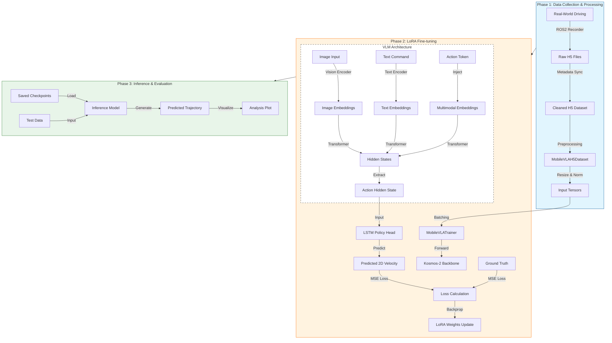

# 🏗️ Mobile VLA 프로젝트 구조 및 모델 세부 아키텍처 (2025-11-20)

## 1. 🔄 전체 프로젝트 진행 구조 (Project Workflow)

지금까지 진행된 데이터 수집부터 학습, 그리고 추론 준비까지의 전체 파이프라인입니다.



---

## 2. 🧠 모델 세부 아키텍처 (Detailed Model Architecture)

현재 우리가 구축한 **Mobile VLA (Vision-Language-Action)** 모델의 내부 데이터 흐름 상세입니다.

### Step 1: VLM Backbone (Kosmos-2)
*   **입력**:
    *   **이미지**: $224 \times 224$ RGB (현재 윈도우의 마지막 프레임 또는 전체 시퀀스)
    *   **텍스트**: "Navigate to target..." (명령어)
    *   **Action Token**: `[LRN]` (학습 가능한 벡터, 액션 정보를 모으는 역할)
*   **처리**:
    1.  이미지는 `Vision Encoder`를 거쳐 임베딩 벡터로 변환됩니다.
    2.  텍스트는 `Text Encoder`를 거쳐 임베딩 벡터로 변환됩니다.
    3.  이 두 임베딩 뒤에 `[LRN]` 토큰이 붙어서 Transformer에 입력됩니다.
    4.  Transformer의 출력 중 `[LRN]` 위치에 해당하는 벡터($h_{action}$)만 추출합니다.

### Step 2: Action Head (LSTM Decoder)
*   **목적**: 정적인 $h_{action}$ 벡터를 시계열적인 **미래 행동(Trajectory)**으로 변환합니다.
*   **입력**: `Action Hidden State` ($h_{action}$) - 크기: `(Batch, Hidden_Dim=2048)`
*   **구조**:
    ```mermaid
    graph LR
        Input(Action Hidden State) -->|Reshape/Expand| LSTM_In(LSTM Input Sequence)
        LSTM_In -->|Layer 1| LSTM1[LSTM Layer]
        LSTM1 -->|Hidden States| Linear[Linear Projection]
        Linear -->|Output| Action(Predicted Velocity)
        
        style LSTM_In fill:#f9f,stroke:#333
        style Action fill:#ff9,stroke:#333
    end
    ```
*   **구체적 동작 (MobileVLALSTMDecoder)**:
    1.  **입력 확장**: $h_{action}$ 벡터를 우리가 예측하고자 하는 미래 스텝 수(10개)만큼 복사하거나, 초기 Hidden State($h_0, c_0$)로 사용합니다.
    2.  **LSTM 연산**:
        $$ h_t, c_t = \text{LSTM}(x_t, (h_{t-1}, c_{t-1})) $$
        여기서 $x_t$는 이전 스텝의 액션일 수도 있고, $h_{action}$의 복사본일 수도 있습니다.
    3.  **Linear Projection**: LSTM의 각 스텝 출력 $h_t$를 2차원(Linear X, Linear Y) 벡터로 변환합니다.
        $$ \text{Action}_t = \text{Linear}(h_t) $$
    4.  **출력**: `(Batch, 10, 2)` 형태의 텐서.

---

## 3. 🔍 LSTM Layer 구현 확인 및 검증 (To-Do)

사용자님께서 말씀하신 대로 **LSTM Layer 부분에 대한 확인**이 필요합니다. 현재 코드가 단순한 MLP(Linear)가 아니라 실제로 시계열적인 LSTM을 타고 있는지, 그리고 그 입력이 올바르게 들어가는지 확인하겠습니다.

**확인 포인트**:
1.  `MobileVLALSTMDecoder` 클래스 내부에서 `nn.LSTM`을 실제로 사용하고 있는가?
2.  `forward` 메서드에서 `action_hs`를 시퀀스로 잘 변환하여 LSTM에 넣고 있는가?
3.  출력 형태가 `(Batch, 10, 2)`가 확실한가?

이 부분을 바로 코드로 확인해 드리겠습니다.

