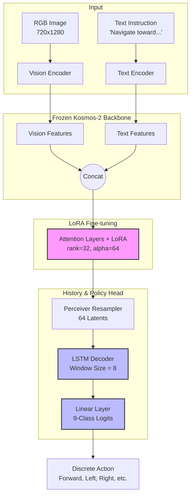
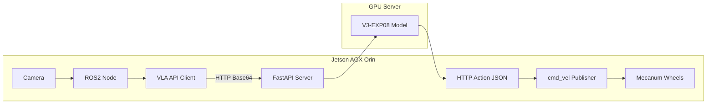

# Mobile VLA Project - Vision-Language-Action for Mobile Robot Navigation

> 모바일 로봇(Jetson AGX Orin)의 시각-언어 기반 장애물 회피 주행을 위한 VLA 모델 연구

**프로젝트 기간**: 2025-11 ~ 현재  
**최종 업데이트**: 2026-03-06
**Status**: ✅ Phase 1 완료 (V1~V3 학습 최적화) | 🚀 Phase 2 진행중 (데이터 증강 및 추론 테스트)

---

## 📋 목차

- [프로젝트 개요](#-프로젝트-개요)
- [주요 성과 (V3-EXP08)](#-주요-성과-v3-exp08)
- [시스템 아키텍처](#-시스템-아키텍처)
- [VLA 모델 진화 역사 (V1~V3)](#-vla-모델-진화-역사-v1v3)
- [현재 한계점 및 Phase 2 계획](#-현재-한계점-및-phase-2-계획)
- [디렉토리 구조](#-디렉토리-구조)
- [문서](#-문서)

---

## 🎯 프로젝트 개요

### 목표
모바일 로봇의 **명령 기반 장애물 회피 주행**을 위한 Vision-Language-Action (VLA) 모델 개발. "바스켓이 중앙에 올 때까지 향해라" 와 같은 자연어 지시를 이해하고 실제 조향 명령을 내립니다.

### 핵심 제원
- **Input**: RGB 이미지 (720x1280, Fisheye) + 자연어 명령(Instruction)
- **Output**: 9-Class Discrete Action (Mecanum wheel 제어를 위한 이산화된 이동 명령)
- **VLM Backbone**: Kosmos-2 (`microsoft/kosmos-2-patch14-224`)
- **Optimization**: LoRA Fine-tuning (rank=32, alpha=64) 기반 시각-언어 그라운딩

---

## 🏆 주요 성과 (V3-EXP08)

현재 최고 성능 모델인 **V3-EXP08**은 데이터 불균형 문제를 해소하고, "목표물 중심(Goal-Centric)" Instruction을 적용하여 오프라인 평가에서 완벽한 수렴을 달성했습니다.

```text
Model: mobile_vla_v3_exp08_center_goal
Checkpoint: epoch=07-val_loss=0.031.ckpt
Strategy: Kosmos-2 + LoRA (r=32) + 9-Class Discrete Classification (Class Weights 역수 적용)
Performance: In-Distribution Offline PM(Perfect Match) 100%, DM(Direction Match) 100%
```

---

## 🏗️ 시스템 아키텍처

### 1. VLA 모델 파이프라인 (Current: V3)



### 2. 전체 시스템 구조



---

## 📈 VLA 모델 진화 역사 (V1~V3)

| 설계 | 접근 방식 | VLM 상태 | Action Head | 주요 발견 및 한계 |
|:---:|:---|:---:|:---|:---|
| **V1** | Continuous Regression | Frozen | Linear (Continuous 2D) | 직진(다수 클래스)으로 수렴하는 심각한 편향 발생 |
| **V2** | Discrete Classification | Frozen | Linear (9-Class) | 분류 문제로 변환하여 편향 극복. 그러나 VLM이 Frozen되어 이미지-텍스트 간 Grounding(상호 이해) 불가 |
| **V3** | Classification + LoRA | **LoRA** | LSTM + Linear (9-Class) | LoRA를 통한 Grounding 성공, Class Weighting으로 불균형 해소. 오프라인 평가(PM/DM) 100% 수렴 |

> 📌 **상세 실험 기록**: 모든 실험 메트릭과 히스토리는 [`docs/experiments_v1_to_v3_comprehensive.md`](docs/experiments_v1_to_v3_comprehensive.md)에서 확인할 수 있습니다.

---

## 🔍 현재 한계점 및 Phase 2 계획

### 한계점: "타이밍 암기(Timing Memorization)" 현상
V3-EXP08 모델 검증 결과, 오프라인 정확도 100%라는 수치가 **모델이 실제 시각적 객체(장애물, 목표)를 이해한 것이 아니라, 학습 데이터 에피소드의 '진행 시간(Frame 넘버)'과 액션을 단순 암기(Causal Confusion)한 결과**임이 밝혀졌습니다. (상세 분석: `docs/dataset_analysis_basket_v2_20260306.md`)

### Phase 2 해결 계획 (Dataset v3)
단순 프레임 암기를 파훼하기 위해, 동일 시간(Step)에 완전히 다른 시각적 맥락(장애물 유무, 늦은 등장 등)을 제공하는 **4가지 데이터 변형(Close, Far, Offset, No-obstacle)**을 신규 수집하기로 결정했습니다.
자세한 훈련 계획 및 검증 방안은 `docs/training_plan_dataset_v3_20260306.md` 문서에 정리되어 있습니다.

---

## 📁 디렉토리 구조

```
vla/
├── Mobile_VLA/              # 핵심 VLA 모델 구현부 (API, Configs)
├── RoboVLMs/                # VLM 백본 라이브러리 및 훈련 코어 (Kosmos-2 통합)
├── robovlm_nav/             # Customized Training Pipeline 및 Nav-Policy 구현
├── scripts/                 # 훈련 및 추론 실험용 유틸리티 스크립트 모음
├── docs/                    # 분석 보고서, 설계 문서, 가이드라인 (V1~V3 포함)
│   ├── experiments_v1_to_v3_comprehensive.md  # V1~V3 종합 실험 기록
│   ├── training_plan_dataset_v3_20260306.md   # 차세대 학습 전략
│   ├── dataset_analysis_basket_v2_20260306.md # 데이터 편향 정량 분석
│   └── research_progress_report_20260306.md   # 전체 연구 진행 상황 보고서
├── ROS_action/              # 로봇에서 수집된 실제 주행 데이터셋 경로
└── README.md                # 현재 개요 파일
```

---

## 📚 문서

프로젝트와 관련된 심도 있는 분석 및 계획은 `docs/` 내 다음 문서를 참고하세요:

- **[V1~V3 종합 실험 기록보관소](docs/experiments_v1_to_v3_comprehensive.md)**: 초창기 Regression부터 V3 LoRA Classification에 이르는 전체 하이퍼파라미터 및 손실/정확도 로깅
- **[Dataset v2 정량 분석 보고서](docs/dataset_analysis_basket_v2_20260306.md)**: "타이밍 암기" 문제에 대한 표준편차 및 Action Sequence 분석
- **[Dataset v3 훈련 계획서](docs/training_plan_dataset_v3_20260306.md)**: Causal Confusion을 깰 4가지 데이터 변형 및 Instruction 재설계
- **[연구 진행 리포트](docs/research_progress_report_20260306.md)**: 현재 연구 Phase 요약 및 아키텍처 개편 내역
