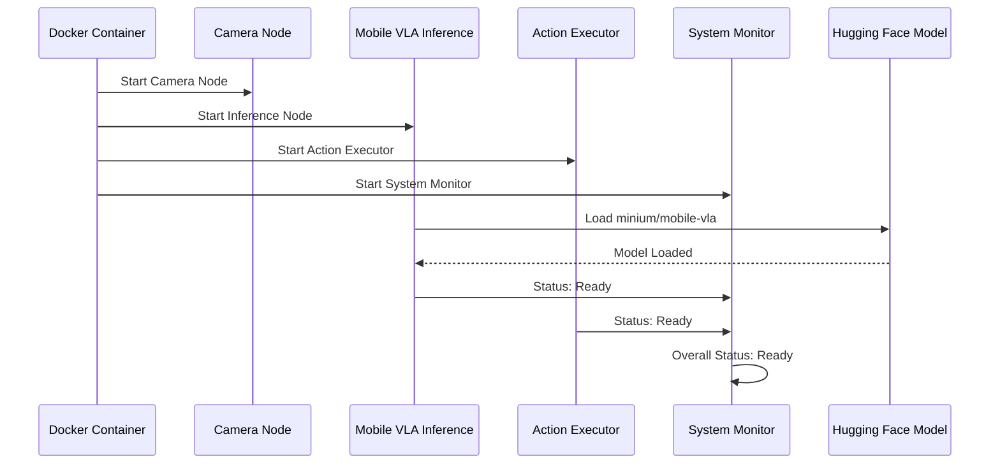
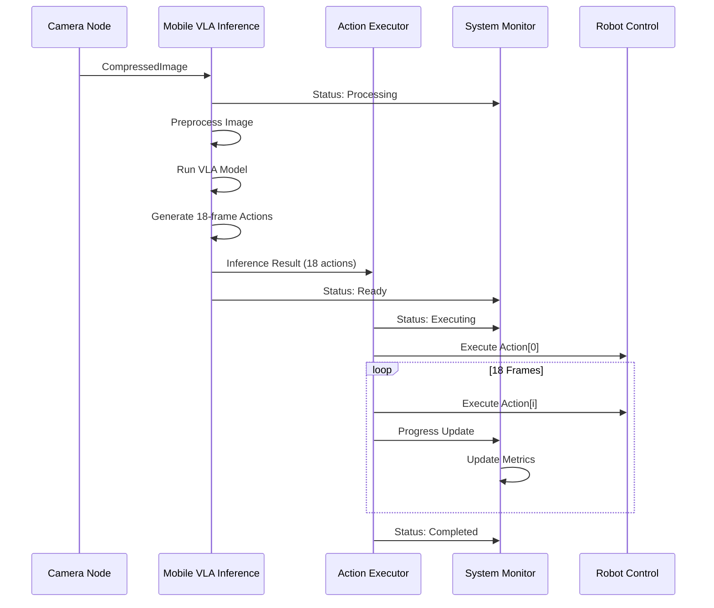
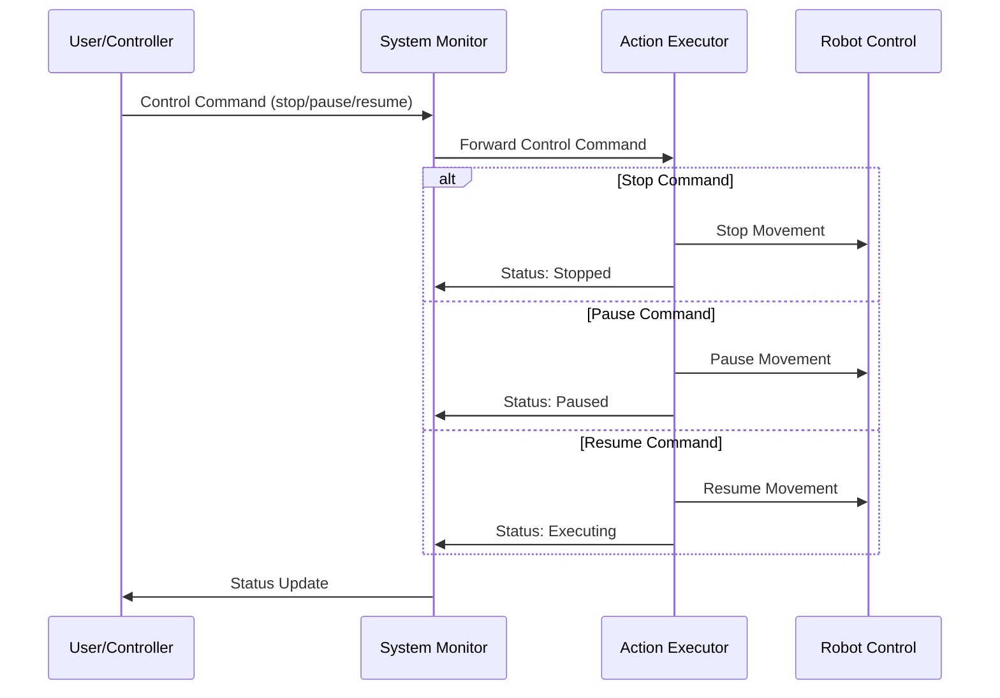

# Mobile VLA System - Docker Sequence Diagram & Architecture

## 🏗️ 시스템 아키텍처

```
┌─────────────────────────────────────────────────────────────────┐
│                    Mobile VLA System                           │
├─────────────────────────────────────────────────────────────────┤
│  ┌─────────────┐    ┌─────────────┐    ┌─────────────┐        │
│  │   Camera    │    │  Inference  │    │  Action     │        │
│  │   Node      │───▶│   Node      │───▶│  Executor   │        │
│  │             │    │             │    │   Node      │        │
│  └─────────────┘    └─────────────┘    └─────────────┘        │
│         │                   │                   │              │
│         │                   │                   │              │
│         ▼                   ▼                   ▼              │
│  ┌─────────────┐    ┌─────────────┐    ┌─────────────┐        │
│  │  System     │    │  Hugging    │    │  Robot      │        │
│  │  Monitor    │    │  Face       │    │  Control    │        │
│  │             │    │  Model      │    │             │        │
│  └─────────────┘    └─────────────┘    └─────────────┘        │
└─────────────────────────────────────────────────────────────────┘
```

## 🔄 시퀀스 다이어그램

### 1. 시스템 초기화 시퀀스



### 2. 이미지 처리 및 추론 시퀀스



### 3. 실시간 제어 시퀀스



## 🐳 Docker 컨테이너 구조

### 컨테이너 구성

```yaml
# docker-compose.mobile-vla.yml
version: '3.8'
services:
  mobile-vla-system:
    build:
      context: .
      dockerfile: Dockerfile.mobile-vla
    container_name: mobile-vla-container
    environment:
      - ROS_DOMAIN_ID=0
      - DISPLAY=${DISPLAY}
    volumes:
      - /tmp/.X11-unix:/tmp/.X11-unix
      - ./ROS_action:/workspace/vla/ROS_action
      - ./mobile_vla_dataset:/workspace/vla/mobile_vla_dataset
    network_mode: host
    runtime: nvidia  # GPU 지원
    devices:
      - /dev/video0:/dev/video0  # 카메라
    command: bash -c "source /opt/ros/humble/setup.bash && cd /workspace/vla/ROS_action && colcon build && source install/setup.bash && ros2 launch mobile_vla_package launch_mobile_vla.launch.py"
```

### Dockerfile 구조

```dockerfile
# Dockerfile.mobile-vla
FROM nvidia/cuda:11.8-devel-ubuntu20.04

# 시스템 패키지 설치
RUN apt-get update && apt-get install -y \
    python3-pip \
    python3-dev \
    git \
    curl \
    wget \
    && rm -rf /var/lib/apt/lists/*

# ROS2 Humble 설치
RUN curl -sSL https://raw.githubusercontent.com/ros/rosdistro/master/ros.key -o /usr/share/keyrings/ros-archive-keyring.gpg
RUN echo "deb [arch=$(dpkg --print-architecture) signed-by=/usr/share/keyrings/ros-archive-keyring.gpg] http://packages.ros.org/ros2/ubuntu $(. /etc/os-release && echo $UBUNTU_CODENAME) main" | tee /etc/apt/sources.list.d/ros2.list > /dev/null
RUN apt-get update && apt-get install -y ros-humble-ros-base ros-humble-cv-bridge

# Python 패키지 설치
COPY requirements.txt /tmp/
RUN pip3 install -r /tmp/requirements.txt

# Mobile VLA 모델 다운로드
RUN python3 -c "from transformers import AutoModel, AutoProcessor; AutoModel.from_pretrained('minium/mobile-vla'); AutoProcessor.from_pretrained('minium/mobile-vla')"

# 작업 디렉토리 설정
WORKDIR /workspace/vla

# ROS 환경 설정
RUN echo "source /opt/ros/humble/setup.bash" >> ~/.bashrc
```

## 📊 시스템 성능 메트릭

### 추론 성능
- **모델**: minium/mobile-vla (Hugging Face)
- **입력**: RGB 이미지 (224x224) + 텍스트 태스크
- **출력**: 18프레임 액션 시퀀스 [linear_x, linear_y, angular_z]
- **예상 추론 시간**: 100-500ms (GPU 기준)

### 실행 성능
- **프레임 레이트**: 10Hz (100ms per frame)
- **액션 시퀀스 길이**: 18프레임
- **전체 실행 시간**: 1.8초 (18 frames × 100ms)

### 시스템 요구사항
- **GPU**: NVIDIA GPU (CUDA 11.8+)
- **메모리**: 8GB+ RAM
- **저장공간**: 5GB+ (모델 포함)
- **네트워크**: 인터넷 연결 (모델 다운로드)

## 🔧 사용 방법

### 1. 시스템 시작
```bash
# Docker 컨테이너 빌드 및 실행
docker-compose -f docker-compose.mobile-vla.yml up --build

# 또는 개별 노드 실행
ros2 launch mobile_vla_package launch_mobile_vla.launch.py inference_node:=true
```

### 2. 태스크 설정
```bash
# 태스크 업데이트
ros2 topic pub /mobile_vla/task std_msgs/msg/String "data: 'Navigate around obstacles to track the target cup'"
```

### 3. 시스템 모니터링
```bash
# 시스템 상태 확인
ros2 topic echo /mobile_vla/system_status

# 성능 메트릭 확인
ros2 topic echo /mobile_vla/performance_metrics
```

### 4. 제어 명령
```bash
# 실행 중지
ros2 topic pub /mobile_vla/control std_msgs/msg/String '{"action": "stop"}'

# 프레임 레이트 변경
ros2 topic pub /mobile_vla/control std_msgs/msg/String '{"action": "set_frame_rate", "frame_rate": 5.0}'
```

## 🎯 주요 기능

1. **실시간 VLM 추론**: 단일 이미지로 18프레임 액션 예측
2. **순차적 액션 실행**: 예측된 액션을 순차적으로 로봇에 전송
3. **시스템 모니터링**: 전체 시스템 상태 및 성능 추적
4. **동적 제어**: 실시간으로 실행 상태 제어
5. **Docker 컨테이너화**: 일관된 실행 환경 제공

## 📝 참고 자료

- [Mobile VLA Model (Hugging Face)](https://huggingface.co/minium/mobile-vla)
- [ROS2 Humble Documentation](https://docs.ros.org/en/humble/)
- [Transformers Library](https://huggingface.co/docs/transformers/)
