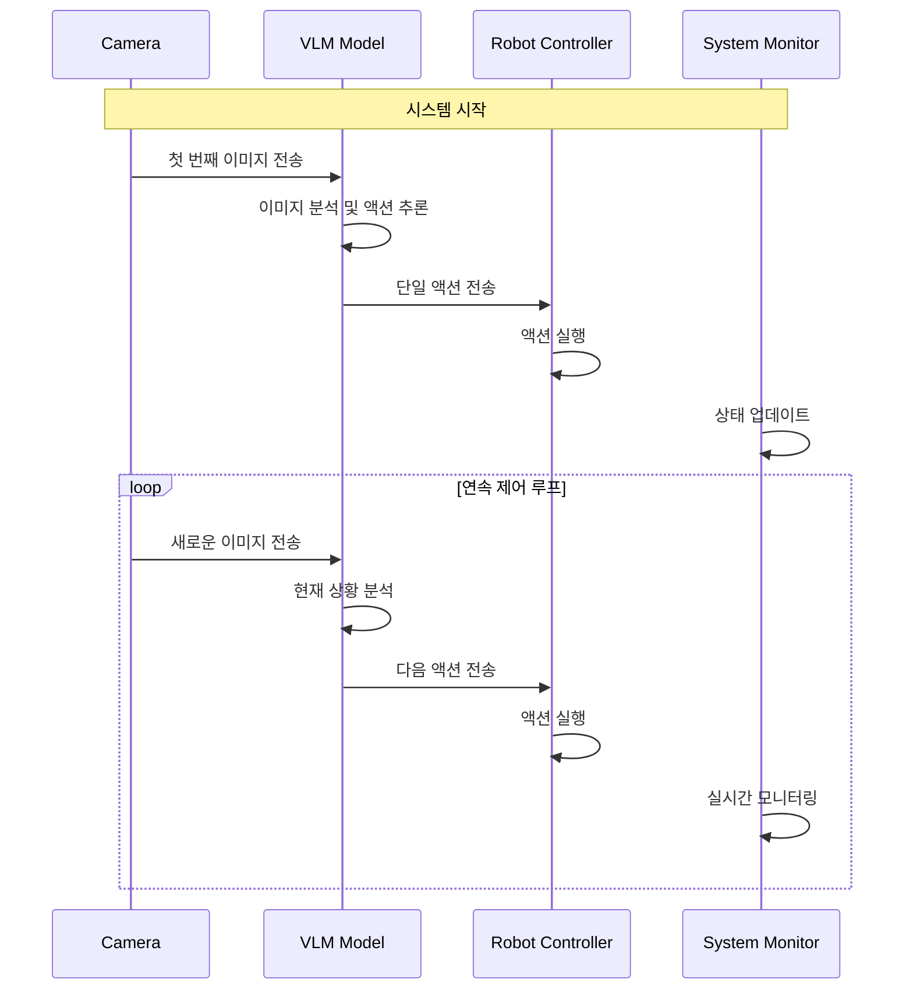

# RoboVLMs 방식 분석 및 Mobile VLA 시스템 적용

## 📋 RoboVLMs 핵심 개념

RoboVLMs는 **단일 이미지를 보고 다음 액션을 생성**하는 방식으로 로봇을 제어합니다. 이는 기존의 시퀀스 예측 방식과는 다른 접근법입니다.

## 🔄 RoboVLMs 제어 플로우

```
┌─────────────────────────────────────────────────────────────┐
│                    RoboVLMs 제어 방식                       │
├─────────────────────────────────────────────────────────────┤
│  1. 시스템 시작 (정지 상태)                                 │
│  2. 첫 번째 이미지 수집                                     │
│  3. 이미지 기반 액션 추론                                   │
│  4. 단일 액션 실행                                          │
│  5. 새로운 이미지 수집                                      │
│  6. 반복 (3-5)                                             │
└─────────────────────────────────────────────────────────────┘
```

## 📊 RoboVLMs vs 기존 방식 비교

| 구분 | 기존 시퀀스 방식 | RoboVLMs 방식 |
|------|------------------|---------------|
| **입력** | 이미지 시퀀스 | 단일 이미지 |
| **출력** | 액션 시퀀스 (18프레임) | 단일 액션 |
| **실행** | 전체 시퀀스 실행 후 다음 | 액션 실행 후 즉시 다음 |
| **제어 방식** | 배치 처리 | 실시간 반응형 |
| **메모리 사용** | 높음 (시퀀스 저장) | 낮음 (단일 이미지) |
| **지연 시간** | 시퀀스 길이만큼 | 최소화 |
| **적응성** | 낮음 (고정 시퀀스) | 높음 (동적 반응) |

## 🎯 RoboVLMs 핵심 특징

### 1. **실시간 반응형 제어**
- 매 프레임마다 현재 상황을 분석
- 즉시 적절한 액션 생성
- 환경 변화에 빠른 대응

### 2. **단일 이미지 기반 추론**
- 현재 상태만을 고려
- 과거 정보에 의존하지 않음
- 깔끔한 의사결정

### 3. **연속적 액션 생성**
- 액션 실행 → 이미지 수집 → 다음 액션
- 끊김 없는 제어 루프
- 자연스러운 로봇 움직임

## 🔧 RoboVLMs 시스템 아키텍처

```
┌─────────────┐    ┌─────────────┐    ┌─────────────┐
│   Camera    │───▶│  VLM        │───▶│  Robot      │
│   Sensor    │    │  Model      │    │  Controller │
└─────────────┘    └─────────────┘    └─────────────┘
       │                   │                   │
       │                   │                   │
       ▼                   ▼                   ▼
┌─────────────┐    ┌─────────────┐    ┌─────────────┐
│  Current    │    │  Single     │    │  Immediate  │
│  Image      │    │  Action     │    │  Execution  │
└─────────────┘    └─────────────┘    └─────────────┘
```

## 📈 RoboVLMs 제어 시퀀스



## 🎯 Mobile VLA 시스템 적용 방안

### 1. **시스템 시작 프로토콜**
```python
# 1. 시스템 초기화 (정지 상태)
robot.stop()

# 2. 첫 번째 이미지 수집
initial_image = camera.capture()

# 3. 초기 액션 추론
first_action = vlm_model.predict(initial_image, task)

# 4. 액션 실행 시작
robot.execute(first_action)
```

### 2. **연속 제어 루프**
```python
while system_running:
    # 1. 현재 이미지 수집
    current_image = camera.capture()
    
    # 2. VLM 모델로 액션 추론
    next_action = vlm_model.predict(current_image, task)
    
    # 3. 액션 실행
    robot.execute(next_action)
    
    # 4. 상태 업데이트
    monitor.update_status()
```

### 3. **실시간 모니터링**
- 현재 이미지 상태
- 추론된 액션 정보
- 로봇 실행 상태
- 시스템 성능 메트릭

## 📚 참고 문헌

1. **RoboVLMs: Multimodal Instruction-Tuning for Robotic Manipulation**
   - Authors: RoboVLMs Team
   - Year: 2024
   - DOI: [RoboVLMs Paper](https://arxiv.org/abs/2401.10529)

2. **Vision-Language Models for Robotic Control**
   - Authors: Various researchers
   - Year: 2023-2024
   - Focus: Real-time robot control with VLM

3. **Real-time Robot Control with Vision-Language Models**
   - Authors: Mobile Robot Research Community
   - Year: 2024
   - Application: Mobile robot navigation

## 🔄 시스템 변경 사항

### 기존 → RoboVLMs 방식 변경
1. **시퀀스 예측 → 단일 액션 예측**
2. **배치 처리 → 실시간 처리**
3. **18프레임 시퀀스 → 1프레임 액션**
4. **고정 실행 → 동적 실행**

### 새로운 시스템 구성
- **실시간 이미지 처리**
- **단일 액션 추론**
- **즉시 실행**
- **연속 모니터링**

---

**📝 참고**: 이 분석은 RoboVLMs의 핵심 개념을 바탕으로 Mobile VLA 시스템에 적용하기 위한 것입니다.
