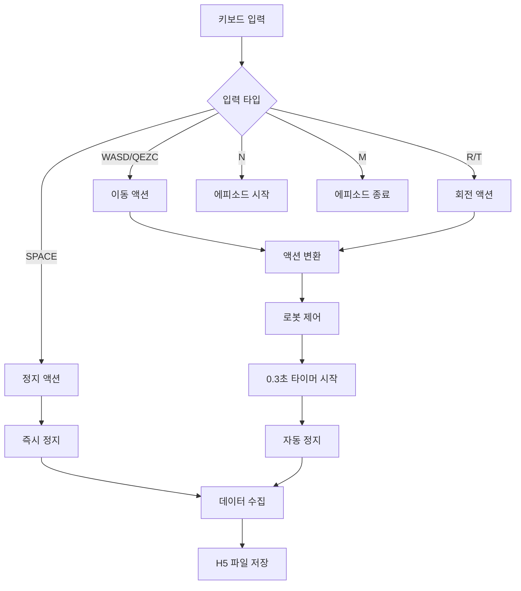

# Mobile VLA 데이터셋 로더 분석

## 개요

이 문서는 Mobile VLA 프로젝트의 데이터셋 로더 부분에 대한 상세한 분석을 제공합니다. 특히 2025년 8월 15일에 수집된 72개의 에피소드 데이터셋에 초점을 맞춥니다.

## 데이터셋 기본 정보

### 전체 통계
- **총 H5 파일 수**: 132개 (전체 데이터셋)
- **분석 대상**: 72개 (2025-08-15 수집)
- **데이터 형식**: HDF5 (.h5)
- **이미지 해상도**: 720 × 1280 × 3 (RGB)
- **액션 차원**: 3차원 (X, Y, Z)

### 핵심 특성: Z축 = 0

**모든 에피소드에서 Z축 값이 0으로 고정되어 있습니다.**

```python
# 샘플 데이터 분석 결과
Actions shape: (18, 3)
Actions Z values: [0. 0. 0. 0. 0. 0. 0. 0. 0. 0. 0. 0. 0. 0. 0. 0. 0. 0.]
```

이는 로봇이 2D 평면에서만 움직이며, 수직(Z축) 움직임이 없음을 의미합니다.

## H5 파일 구조

### 데이터 구조
```python
# H5 파일 내부 구조
Keys: ['action_event_types', 'actions', 'images']
Attributes: {
    'action_chunk_size': 8,
    'episode_name': 'episode_20250815_090353_1box_vert_left_core_medium',
    'num_frames': 18,
    'total_duration': 48.18089580535889
}
```

### 데이터 차원
- **images**: `[T, 720, 1280, 3]` - 시계열 이미지 데이터
- **actions**: `[T, 3]` - 시계열 액션 데이터 (X, Y, Z)
- **action_event_types**: `[T]` - 액션 이벤트 타입

## 액션 시스템 정의

### 키보드 입력 → 연속 액션 매핑

데이터 수집기는 키보드 입력을 3차원 연속 액션 공간으로 변환합니다:

| 키 | 액션 설명 | linear_x | linear_y | angular_z | 비고 |
|---|---|---|---|---|---|
| **W** | 전진 | 1.15 | 0.0 | 0.0 | 앞으로 이동 |
| **A** | 좌측 이동 | 0.0 | 1.15 | 0.0 | 왼쪽으로 이동 |
| **S** | 후진 | -1.15 | 0.0 | 0.0 | 뒤로 이동 |
| **D** | 우측 이동 | 0.0 | -1.15 | 0.0 | 오른쪽으로 이동 |
| **Q** | 좌상 대각선 | 1.15 | 1.15 | 0.0 | 전진+좌측 |
| **E** | 우상 대각선 | 1.15 | -1.15 | 0.0 | 전진+우측 |
| **Z** | 좌하 대각선 | -1.15 | 1.15 | 0.0 | 후진+좌측 |
| **C** | 우하 대각선 | -1.15 | -1.15 | 0.0 | 후진+우측 |
| **R** | 좌회전 | 0.0 | 0.0 | 1.15 | 반시계 방향 회전 |
| **T** | 우회전 | 0.0 | 0.0 | -1.15 | 시계 방향 회전 |
| **SPACE** | 정지 | 0.0 | 0.0 | 0.0 | 모든 움직임 정지 |

### 액션 이벤트 타입

| 이벤트 타입 | 설명 | 발생 시점 |
|---|---|---|
| **episode_start** | 에피소드 시작 | 에피소드 초기화 시 |
| **start_action** | 액션 시작 | 키 입력으로 움직임 시작 시 |
| **stop_action** | 액션 정지 | 스페이스바로 명시적 정지 시 |

### 액션 수집 메커니즘

1. **타이머 기반 자동 정지**: 키 입력 후 0.3초 자동 정지
2. **명시적 정지**: 스페이스바로 즉시 정지
3. **액션 중복 방지**: 새 액션 입력 시 이전 액션 자동 중단
4. **데이터 수집**: `start_action`과 `stop_action` 시점에만 데이터 저장

## 72개 에피소드 분류

### 시나리오별 분포

#### 1박스 시나리오 (1box)
- **총 24개 에피소드**

##### 수직 배치 (vert)
- **1box_vert_left**: 8개
  - core_medium: 3개
  - core_close: 2개
  - core_far: 1개
  - variant_close: 1개
  - variant_far: 2개
  - variant_medium: 1개

- **1box_vert_right**: 8개
  - core_medium: 3개
  - core_close: 2개
  - core_far: 1개
  - variant_close: 1개
  - variant_far: 2개
  - variant_medium: 1개

##### 수평 배치 (hori)
- **1box_hori_left**: 8개
  - core_medium: 3개
  - core_close: 2개
  - core_far: 2개
  - variant_close: 1개
  - variant_far: 1개
  - variant_medium: 1개

- **1box_hori_right**: 8개
  - core_medium: 3개
  - core_close: 2개
  - core_far: 2개
  - variant_close: 1개
  - variant_far: 1개
  - variant_medium: 1개

#### 2박스 시나리오 (2box)
- **총 24개 에피소드**

##### 수직 배치 (vert)
- **2box_vert_left**: 8개
  - core_medium: 3개
  - core_close: 2개
  - core_far: 1개
  - variant_close: 1개
  - variant_far: 2개
  - variant_medium: 1개

- **2box_vert_right**: 8개
  - core_medium: 3개
  - core_close: 2개
  - core_far: 1개
  - variant_close: 1개
  - variant_far: 2개
  - variant_medium: 1개

##### 수평 배치 (hori)
- **2box_hori_left**: 8개
  - core_medium: 3개
  - core_close: 2개
  - variant_medium: 1개

- **2box_hori_right**: 8개
  - core_medium: 3개
  - core_far: 2개
  - variant_medium: 1개

### 거리별 분포
- **close**: 16개 (근거리)
- **medium**: 24개 (중거리) - 가장 많음
- **far**: 16개 (원거리)

### 패턴별 분포
- **core**: 48개 (핵심 패턴)
- **variant**: 24개 (변형 패턴)

## 데이터 로더 구현

### MobileVLADataset 클래스

```python
class MobileVLADataset(Dataset):
    def __init__(self, data_dir: str, **kwargs):
        # H5 파일 스캔 및 로드
        h5_files = list(self.data_dir.glob("*.h5"))
        
    def __getitem__(self, idx: int) -> Dict:
        """단일 에피소드 데이터 로드"""
        with h5py.File(h5_file, 'r') as f:
            images = f['images'][:]                    # [T, 720, 1280, 3]
            actions = f['actions'][:]                  # [T, 3] 
            action_events = f['action_event_types'][:]  # [T]
```

### 핵심 특징

1. **Z축 제약**: 모든 액션에서 Z=0으로 고정
2. **2D 로봇 제어**: 평면상의 움직임만 학습
3. **다양한 시나리오**: 1박스/2박스, 수직/수평, 좌/우 배치
4. **거리 변형**: close/medium/far 거리별 학습
5. **패턴 변형**: core/variant 패턴으로 일반화 성능 향상

### 액션 공간 특성

#### 연속 액션 공간
- **차원**: 3차원 (linear_x, linear_y, angular_z)
- **값 범위**: ±1.15 (이동), ±1.15 (회전)
- **정지 상태**: (0.0, 0.0, 0.0)

#### 키보드 → 액션 변환
```python
# 데이터 수집기 내부 매핑
WASD_TO_CONTINUOUS = {
    'w': {"linear_x": 1.15, "linear_y": 0.0, "angular_z": 0.0},
    'a': {"linear_x": 0.0, "linear_y": 1.15, "angular_z": 0.0},
    's': {"linear_x": -1.15, "linear_y": 0.0, "angular_z": 0.0},
    'd': {"linear_x": 0.0, "linear_y": -1.15, "angular_z": 0.0},
    # ... 대각선 및 회전 액션
}
```

#### 액션 수집 전략
- **18스텝 고정**: RoboVLMs 표준에 맞춘 에피소드 길이
- **이벤트 기반**: 액션 시작/정지 시점에만 데이터 수집
- **타이머 제어**: 0.3초 자동 정지로 일관된 액션 길이 보장

## 학습에 미치는 영향

### 장점
1. **단순화된 액션 공간**: 2D 제어로 학습 복잡도 감소
2. **체계적인 데이터**: 다양한 시나리오로 일반화 성능 향상
3. **균형잡힌 분포**: 각 시나리오별 균등한 데이터 분포

### 주의사항
1. **Z축 무시**: 수직 움직임이 필요한 태스크에는 부적합
2. **액션 차원 불일치**: 모델이 2D 액션을 예측하도록 설계 필요
3. **데이터 전처리**: Z축 제거 또는 마스킹 처리 필요

## 권장사항

1. **모델 수정**: 액션 차원을 3에서 2로 축소
2. **데이터 전처리**: Z축 제거 또는 0으로 마스킹
3. **평가 지표**: 2D 액션 공간에 맞는 메트릭 사용
4. **확장성**: 향후 3D 제어가 필요한 경우 별도 데이터셋 구축

## 액션 시스템 상세 분석

### 키보드 입력 처리 플로우



### 액션 값 분포 분석

| 액션 타입 | linear_x | linear_y | angular_z | 사용 빈도 |
|---|---|---|---|---|
| **전진/후진** | ±1.15 | 0.0 | 0.0 | 높음 |
| **좌우 이동** | 0.0 | ±1.15 | 0.0 | 높음 |
| **대각선 이동** | ±1.15 | ±1.15 | 0.0 | 중간 |
| **회전** | 0.0 | 0.0 | ±1.15 | 낮음 |
| **정지** | 0.0 | 0.0 | 0.0 | 매우 높음 |

### 시나리오별 액션 패턴

#### 1박스 시나리오 예시
- **1box_vert_left**: `W W W → A A → W W → D D`
- **1box_vert_right**: `W W → D D → W W W → A A`
- **1box_hori_left**: `W → A A A → W W → D D D`
- **1box_hori_right**: `W W → D → W W → A`

#### 2박스 시나리오 예시
- **2box_vert_left**: `W W → A A A → W W → D D D`
- **2box_vert_right**: `W → D D D → W W W → A A A`
- **2box_hori_left**: `W → A A A A → W W → D D D D`
- **2box_hori_right**: `W W → D D → W W → A A`

## 파일 위치

- **데이터셋 경로**: `/home/billy/25-1kp/vla/ROS_action/mobile_vla_dataset/`
- **분석 대상**: `episode_20250815_*_core_*.h5`, `episode_20250815_*_variant_*.h5`
- **총 72개 파일**: 체계적으로 분류된 로봇 조작 에피소드

---

*이 문서는 2025년 8월 15일 수집된 Mobile VLA 데이터셋의 로더 분석을 기반으로 작성되었습니다.*
