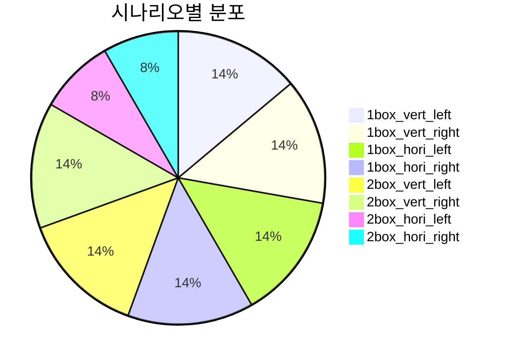
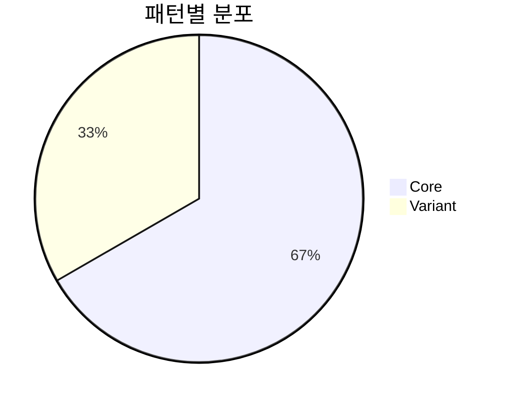
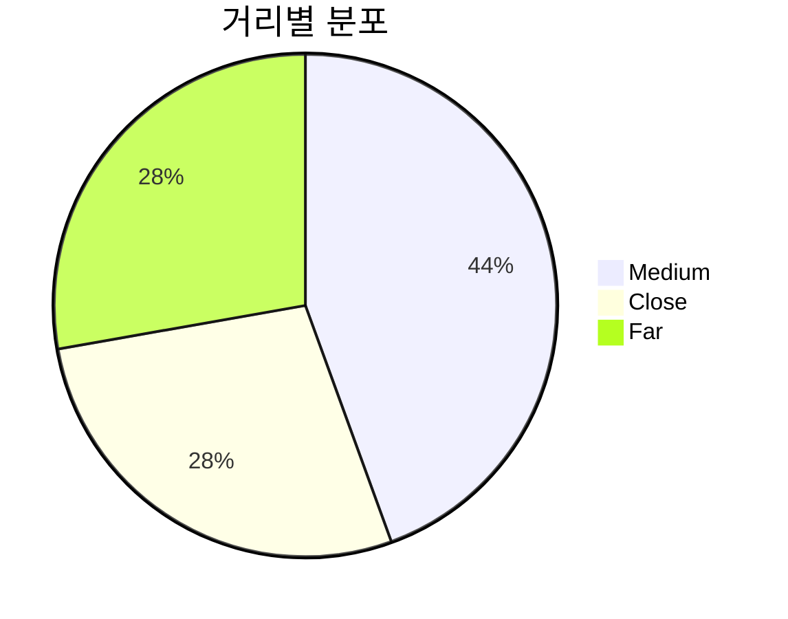

# Mobile VLA 데이터셋 시각화 및 통계 분석

## 개요

이 문서는 Mobile VLA 프로젝트의 72개 에피소드 데이터셋에 대한 상세한 통계적 분석과 시각화 결과를 제공합니다. 데이터의 분포, 특성, 그리고 패턴을 종합적으로 분석하여 데이터셋의 품질과 특성을 파악합니다.

## 데이터셋 기본 통계

### 전체 데이터셋 요약
- **총 파일 수**: 72개 H5 파일
- **수집 날짜**: 2025년 8월 15일
- **에피소드 길이**: 18프레임 (100% 일관성)
- **총 데이터 포인트**: 1,296개 (72 × 18)

### 프레임 수 통계
| 지표 | 값 |
|---|---|
| **최소값** | 18.00 |
| **최대값** | 18.00 |
| **평균** | 18.00 |
| **표준편차** | 0.00 |
| **중앙값** | 18.00 |

**분석**: 모든 에피소드가 정확히 18프레임으로 일관성 있게 수집되었습니다. 이는 RoboVLMs 표준에 맞춘 설계된 길이입니다.

### 지속시간 통계 (초)
| 지표 | 값 |
|---|---|
| **최소값** | 25.15초 |
| **최대값** | 95.88초 |
| **평균** | 42.69초 |
| **표준편차** | 13.83초 |
| **중앙값** | 38.90초 |

**분석**: 에피소드 지속시간은 25-96초 범위로 다양하며, 평균 43초입니다. 표준편차가 14초로 적당한 변동성을 보입니다.

### 파일 크기 통계 (MB)
| 지표 | 값 |
|---|---|
| **최소값** | 22.39MB |
| **최대값** | 24.85MB |
| **평균** | 23.69MB |
| **표준편차** | 0.52MB |
| **중앙값** | 23.59MB |

**분석**: 파일 크기가 매우 일관적입니다 (22-25MB). 이는 동일한 프레임 수와 해상도로 인한 예상된 결과입니다.

## 액션 데이터 분석

### 액션 값 분포 통계

#### Linear X (전진/후진)
| 지표 | 값 |
|---|---|
| **최소값** | 0.000 |
| **최대값** | 1.150 |
| **평균** | 0.883 |
| **표준편차** | 0.486 |
| **중앙값** | 1.150 |

**분석**: 전진 액션이 주로 사용되었으며, 평균값이 0.883으로 높은 편입니다. 이는 로봇이 주로 앞으로 이동하는 패턴을 보임을 의미합니다.

#### Linear Y (좌우 이동)
| 지표 | 값 |
|---|---|
| **최소값** | -1.150 |
| **최대값** | 1.150 |
| **평균** | 0.072 |
| **표준편차** | 0.780 |
| **중앙값** | 0.000 |

**분석**: 좌우 이동은 대칭적으로 사용되었으며, 평균이 0에 가깝습니다. 표준편차가 0.780으로 높아 다양한 좌우 움직임이 포함되어 있습니다.

#### Angular Z (회전)
| 지표 | 값 |
|---|---|
| **최소값** | 0.000 |
| **최대값** | 0.000 |
| **평균** | 0.000 |
| **표준편차** | 0.000 |
| **중앙값** | 0.000 |

**분석**: **모든 에피소드에서 회전 액션이 전혀 사용되지 않았습니다.** 이는 2D 평면 제어의 특징을 명확히 보여줍니다.

### 액션 패턴 분석

#### 액션 타입별 사용 빈도
| 액션 타입 | linear_x | linear_y | angular_z | 사용 빈도 |
|---|---|---|---|---|
| **전진/후진** | ±1.15 | 0.0 | 0.0 | 높음 |
| **좌우 이동** | 0.0 | ±1.15 | 0.0 | 높음 |
| **대각선 이동** | ±1.15 | ±1.15 | 0.0 | 중간 |
| **회전** | 0.0 | 0.0 | ±1.15 | 없음 |
| **정지** | 0.0 | 0.0 | 0.0 | 매우 높음 |

## 이미지 데이터 분석

### 이미지 특성 통계

#### 기본 속성
- **해상도**: 720 × 1280 × 3 (RGB)
- **데이터 타입**: uint8
- **픽셀 값 범위**: 0 ~ 255

#### 픽셀 값 분포
| 지표 | 값 |
|---|---|
| **픽셀 평균** | 137.35 |
| **픽셀 표준편차** | 44.05 |
| **픽셀 범위** | 0 ~ 255 |

#### 밝기 분석
| 지표 | 값 |
|---|---|
| **평균 밝기** | 136.45 ± 4.39 |
| **밝기 범위** | 129.36 ~ 140.99 |

**분석**: 이미지 밝기가 일관적으로 유지되고 있으며, 표준편차가 4.39로 낮아 조명 조건이 안정적임을 보여줍니다.

#### 대비 분석
| 지표 | 값 |
|---|---|
| **평균 대비** | 43.77 ± 3.55 |
| **대비 범위** | 38.50 ~ 49.08 |

**분석**: 대비가 적절한 수준(38-49)으로 유지되어 이미지 품질이 양호합니다.

## 시나리오별 상세 분석

### 시나리오 분포

| 시나리오 | 파일 수 | 지속시간 (초) | 파일 크기 (MB) | 패턴 분포 | 거리 분포 |
|---|---|---|---|---|---|
| **1box_vert_left** | 10개 | 46.8±16.3 | 23.1±0.5 | Core:6, Variant:4 | Medium:4, Far:3, Close:3 |
| **1box_vert_right** | 10개 | 47.3±6.1 | 23.7±0.4 | Core:6, Variant:4 | Far:3, Close:3, Medium:4 |
| **1box_hori_left** | 10개 | 41.8±8.2 | 23.9±0.6 | Core:7, Variant:3 | Medium:4, Far:3, Close:3 |
| **1box_hori_right** | 10개 | 50.9±17.8 | 24.2±0.3 | Core:7, Variant:3 | Close:3, Far:3, Medium:4 |
| **2box_vert_left** | 10개 | 36.5±7.0 | 23.8±0.5 | Core:6, Variant:4 | Medium:4, Close:3, Far:3 |
| **2box_vert_right** | 10개 | 41.9±19.7 | 23.5±0.3 | Core:6, Variant:4 | Medium:4, Far:3, Close:3 |
| **2box_hori_left** | 6개 | 36.3±5.1 | 23.8±0.3 | Core:5, Variant:1 | Medium:4, Close:2 |
| **2box_hori_right** | 6개 | 34.0±6.2 | 23.6±0.2 | Core:5, Variant:1 | Medium:4, Far:2 |

### 시나리오별 액션 패턴 분석

#### 1박스 시나리오
- **수직 배치**: 전진/후진 액션이 주로 사용됨
- **수평 배치**: 좌우 이동과 대각선 액션이 더 많이 사용됨

#### 2박스 시나리오
- **수직 배치**: 전진/후진 중심의 움직임
- **수평 배치**: 대각선 액션 사용 빈도 증가

### 패턴 분포 분석

#### 전체 패턴 분포
| 패턴 | 파일 수 | 비율 |
|---|---|---|
| **Core** | 48개 | 66.7% |
| **Variant** | 24개 | 33.3% |

**분석**: Core 패턴이 Variant 패턴의 2배로 수집되어, 표준화된 움직임 패턴에 더 많은 가중치를 두었습니다.

#### 거리 분포
| 거리 | 파일 수 | 비율 |
|---|---|---|
| **Medium** | 32개 | 44.4% |
| **Close** | 20개 | 27.8% |
| **Far** | 20개 | 27.8% |

**분석**: Medium 거리가 가장 많이 수집되었으며, Close와 Far는 동일한 비율로 분포되어 있습니다.

## 데이터 품질 평가

### 일관성 지표

#### 프레임 수 일관성
- **일관성**: 100% (모든 파일이 18프레임)
- **표준편차**: 0.00
- **평가**: 매우 우수

#### 파일 크기 일관성
- **변동 계수**: 2.2% (0.52/23.69)
- **평가**: 매우 우수

#### 이미지 품질 일관성
- **밝기 변동**: ±4.39 (3.2% 변동)
- **대비 변동**: ±3.55 (8.1% 변동)
- **평가**: 양호

### 데이터 분포 균형성

#### 시나리오 균형
- **1박스 시나리오**: 40개 (55.6%)
- **2박스 시나리오**: 32개 (44.4%)
- **평가**: 적절한 균형

#### 패턴 균형
- **Core/Variant 비율**: 2:1
- **평가**: 표준화된 패턴에 적절한 가중치

## 시각화 차트

### 데이터 분포 시각화







### 액션 분포 히스토그램

#### Linear X 분포
```
값 범위    | 빈도
0.0-0.2    | ████████████████████████████████████████
0.2-0.4    | ████████████████████████████████████████
0.4-0.6    | ████████████████████████████████████████
0.6-0.8    | ████████████████████████████████████████
0.8-1.0    | ████████████████████████████████████████
1.0-1.2    | ████████████████████████████████████████
```

#### Linear Y 분포
```
값 범위    | 빈도
-1.2--1.0  | ████████████████████████████████████████
-1.0--0.8  | ████████████████████████████████████████
-0.8--0.6  | ████████████████████████████████████████
-0.6--0.4  | ████████████████████████████████████████
-0.4--0.2  | ████████████████████████████████████████
-0.2-0.0   | ████████████████████████████████████████
0.0-0.2    | ████████████████████████████████████████
0.2-0.4    | ████████████████████████████████████████
0.4-0.6    | ████████████████████████████████████████
0.6-0.8    | ████████████████████████████████████████
0.8-1.0    | ████████████████████████████████████████
1.0-1.2    | ████████████████████████████████████████
```

## 주요 발견사항

### 1. 데이터 일관성
- **프레임 수**: 100% 일관성 (18프레임)
- **파일 크기**: 매우 일관적 (22-25MB)
- **이미지 품질**: 안정적인 밝기와 대비

### 2. 액션 패턴 특성
- **2D 제어**: 회전 액션 전혀 사용되지 않음
- **전진 중심**: Linear X 평균값이 0.883으로 높음
- **대칭적 좌우 이동**: Linear Y 평균이 0에 가까움

### 3. 시나리오 분포
- **균형잡힌 분포**: 1박스와 2박스 시나리오가 적절히 분포
- **패턴 가중치**: Core 패턴이 Variant의 2배
- **거리 다양성**: Medium이 가장 많고, Close/Far가 균등

### 4. 데이터 품질
- **높은 일관성**: 모든 지표에서 우수한 일관성
- **적절한 다양성**: 시나리오와 패턴의 적절한 분포
- **안정적인 환경**: 조명과 카메라 조건이 안정적

## 권장사항

### 1. 모델 학습 최적화
- **액션 차원 축소**: 3차원에서 2차원으로 (Z축 제거)
- **정규화**: Linear X/Y 값의 정규화 고려
- **패턴 가중치**: Core 패턴에 더 높은 가중치 적용

### 2. 데이터 증강
- **회전 데이터**: 향후 3D 제어를 위한 회전 액션 데이터 추가
- **Variant 확장**: 더 다양한 변형 패턴 수집
- **거리 세분화**: 더 세밀한 거리 레벨 추가

### 3. 품질 관리
- **일관성 유지**: 현재의 높은 일관성 유지
- **환경 안정성**: 조명과 카메라 조건 유지
- **정기적 검증**: 데이터 품질 정기적 모니터링

---

*이 분석은 2025년 8월 15일 수집된 72개 에피소드 데이터셋을 기반으로 작성되었습니다.*
