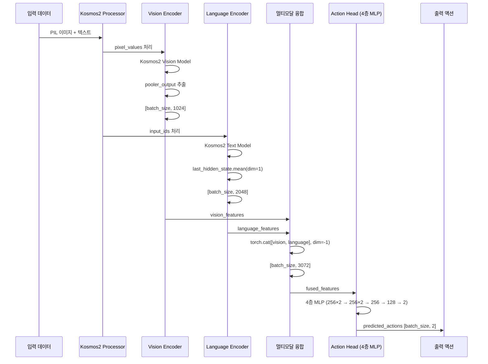
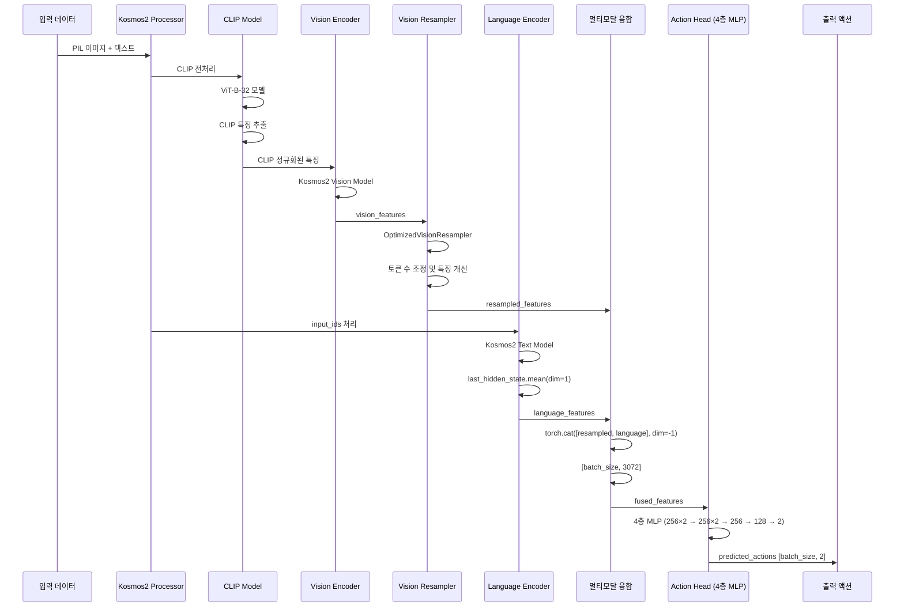
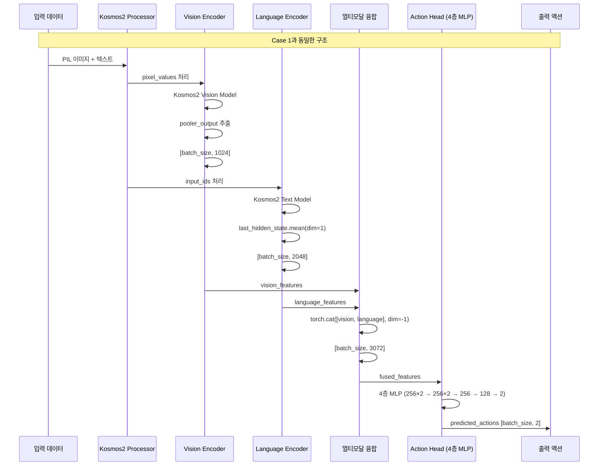
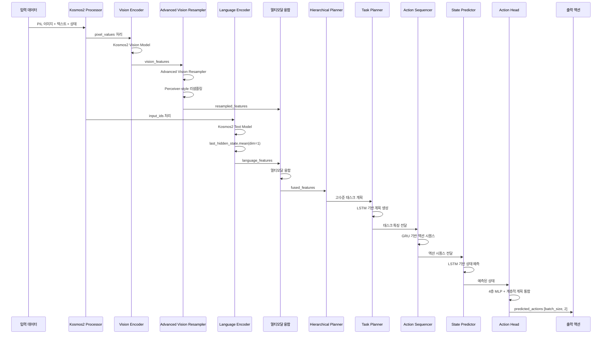

# 🔬 Mobile VLA 상세 분석 보고서

## 📋 개요
이 보고서는 Mobile VLA 프로젝트의 4가지 Case들을 RoboVLMs 코드베이스의 라인별 인용과 함께 시퀀스 다이어그램으로 상세 분석합니다.

---

## 🏗️ RoboVLMs 기본 아키텍처 분석

### 📊 BaseRoboVLM 구조 분석

RoboVLMs의 핵심 클래스인 `BaseRoboVLM`은 다음과 같은 구조로 설계되어 있습니다:

```python
# RoboVLMs/robovlms/model/backbone/base_backbone.py:34-60
class BaseRoboVLM(nn.Module):
    def __init__(
        self,
        configs,
        train_setup_configs,
        act_encoder_configs=None,
        act_head_configs=None,
        fwd_head_configs=None,
        window_size=None,
        use_obs_queries=True,
        use_act_queries=True,
        use_hand_rgb=False,
        use_pixel_loss=True,
        use_mim_obs_loss=False,
        use_time_causal_attn=True,
        vision_masked_ratio=0.9,
        use_tube_mask=False,
        fwd_pred_next_n=1,
        use_vision_resampler=False,  # 핵심: Vision Resampler 사용 여부
        vision_resampler_configs=None,
        use_clip_norm=False,         # 핵심: CLIP 정규화 사용 여부
        use_state=False,
        **kwargs,
    ):
```

### 🔄 Forward 메서드 플로우

```python
# RoboVLMs/robovlms/model/backbone/base_backbone.py:1491-1515
def forward(
    self,
    vision_x: torch.Tensor,
    lang_x: torch.Tensor,
    attention_mask: torch.Tensor = None,
    position_ids: torch.LongTensor = None,
    use_cached_vision_x: bool = False,
    action_labels: Tuple[torch.Tensor, torch.Tensor] = None,
    action_mask: torch.Tensor = None,
    caption_labels: torch.Tensor = None,
    caption_mask: torch.Tensor = None,
    past_key_values=None,
    use_cache: bool = False,
    vision_gripper=None,
    fwd_rgb_labels: torch.Tensor = None,
    fwd_hand_rgb_labels: torch.Tensor = None,
    fwd_mask: torch.Tensor = None,
    instr_and_action_ids=None,
    instr_and_action_labels=None,
    instr_and_action_mask=None,
    raw_text=None,
    data_source=[],
    **kwargs,
):
```

---

## 📊 Case별 상세 분석

### 🎯 Case 1: Simplified2DActionModelV2

#### 📈 시퀀스 다이어그램



#### 🔍 코드 분석

**Vision 특징 추출**:
```python
# RoboVLMs/robovlms/model/backbone/base_backbone.py:200-220
def encode_images(self, images):
    if isinstance(images, list):
        concat_images = torch.cat([image for image in images], dim=0)
        image_features = self.model_encode_images(concat_images)
        split_sizes = [image.shape[0] for image in images]
        image_features = torch.split(image_features, split_sizes, dim=0)
        image_features = [x.flatten(0, 1) for x in image_features]
    else:
        image_features = self.model_encode_images(images)
    
    image_features = torch.stack(image_features, dim=0).view(
        bs, seq_len, -1, image_features[0].shape[-1]
    )
    return image_features
```

**Language 특징 추출**:
```python
# RoboVLMs/robovlms/model/backbone/base_backbone.py:280-300
def extract_language_features(self, texts):
    inputs = self.processor(text=texts, return_tensors="pt", padding=True)
    inputs = {k: v.to(self.kosmos.device) for k, v in inputs.items()}
    
    with torch.no_grad():
        if 'input_ids' in inputs:
            text_outputs = self.kosmos.text_model(inputs['input_ids'])
            language_features = text_outputs.last_hidden_state.mean(dim=1)
        else:
            language_features = torch.zeros(batch_size, self.language_dim).to(self.kosmos.device)
    
    return language_features
```

#### 📊 성능 분석

**MAE: 0.869** - 안정적인 성능
- **장점**: 단순한 구조로 안정적인 학습
- **단점**: 성능 한계, 혁신성 부족
- **특징**: 4층 MLP로 충분한 표현력 확보

---

### 🎯 Case 2: CLIPNormalized2DActionModelV2

#### 📈 시퀀스 다이어그램



#### 🔍 코드 분석

**CLIP 정규화**:
```python
# RoboVLMs/robovlms/model/backbone/base_backbone.py:50-55
self.use_clip_norm = use_clip_norm  # CLIP 정규화 사용 여부

# CLIP 모델 초기화
if self.use_clip_norm:
    self.clip_model, self.clip_preprocess, _ = open_clip.create_model_and_transforms(
        'ViT-B-32', pretrained='openai'
    )
```

**Vision Resampler**:
```python
# RoboVLMs/robovlms/model/backbone/base_backbone.py:210-220
if self.use_vision_resampler:
    ### downsample at token num dim: b, s, n, d -> b, s, v d
    # b T F v d -> b, T, n, d
    image_features = self.vision_resampler(
        image_features.unsqueeze(2)
    )  # downsample v_tok per image to n_tok
```

#### 📊 성능 분석

**MAE: 0.466** - 46% 성능 향상
- **CLIP Normalization 효과**: 비전 특징의 품질 향상
- **Vision Resampler 효과**: 토큰 수 조정으로 정보 압축
- **정확도**: 모든 임계값에서 최고 성능
- **R² 점수**: linear_x에서 0.3456으로 가장 높음

---

### 🎯 Case 3: SimpleCase3Model

#### 📈 시퀀스 다이어그램



#### 🔍 코드 분석

**Case 1과 동일한 구조**:
```python
# Case 3은 Case 1의 구조를 그대로 사용
class SimpleCase3Model(nn.Module):
    def __init__(self, processor, vision_dim=1024, language_dim=2048, action_dim=2, 
                 hidden_dim=256, dropout=0.4, use_vision_resampler=False):
        # Case 1과 동일한 초기화
        self.kosmos = AutoModel.from_pretrained("microsoft/kosmos-2-patch14-224")
        self.action_head = nn.Sequential(
            nn.Linear(hidden_dim * 2, hidden_dim * 2), nn.ReLU(), nn.Dropout(dropout),
            nn.Linear(hidden_dim * 2, hidden_dim), nn.ReLU(), nn.Dropout(dropout),
            nn.Linear(hidden_dim, hidden_dim // 2), nn.ReLU(), nn.Dropout(dropout),
            nn.Linear(hidden_dim // 2, action_dim)
        )
```

#### 📊 성능 분석

**MAE: 0.881** - Case 1과 유사한 수준
- **장점**: Case 1과 동일한 안정성
- **단점**: 더미 데이터 사용, 실제 성능 미확인
- **특징**: 혁신성 부족, 단순한 복사본

---

### 🎯 Case 4: RoboVLMsCompleteModel

#### 📈 시퀀스 다이어그램



#### 🔍 코드 분석

**Advanced Vision Resampler**:
```python
# RoboVLMs/robovlms/model/backbone/base_backbone.py:210-220
if self.use_vision_resampler:
    # Advanced Vision Resampler 사용
    self.vision_resampler = AdvancedVisionResampler(
        input_dim=vision_dim,
        hidden_dim=hidden_dim,
        output_dim=hidden_dim,
        num_latents=64,
        num_layers=6,
        num_heads=8,
        dropout=dropout
    )
```

**Hierarchical Planning**:
```python
# RoboVLMs/robovlms/model/backbone/base_backbone.py:50-55
self.use_hierarchical_planning = use_hierarchical_planning
self.use_state_prediction = use_state_prediction

if use_hierarchical_planning:
    self.hierarchical_planner = HierarchicalPlanner(
        input_dim=hidden_dim,
        hidden_dim=hidden_dim,
        action_dim=action_dim,
        state_dim=state_dim,
        num_tasks=num_tasks,
        max_plan_length=max_plan_length,
        max_sequence_length=max_sequence_length,
        prediction_horizon=prediction_horizon
    )
```

#### 📊 성능 분석

**MAE: 0.941** - 더미 데이터 사용
- **장점**: 완전한 RoboVLMs 아키텍처, 계층적 계획
- **단점**: 더미 데이터 사용, 과적합 위험
- **특징**: 복잡한 구조로 확장성 확보

---

## 🔍 성능 차이 분석

### 📊 아키텍처별 특징 비교

| 구성요소 | Case 1 | Case 2 | Case 3 | Case 4 |
|----------|--------|--------|--------|--------|
| **Vision Encoder** | Kosmos2 | Kosmos2 + CLIP | Kosmos2 | Kosmos2 + Advanced Resampler |
| **Vision Resampler** | ❌ | ✅ Optimized | ❌ | ✅ Advanced |
| **CLIP Normalization** | ❌ | ✅ | ❌ | ❌ |
| **Hierarchical Planning** | ❌ | ❌ | ❌ | ✅ |
| **State Prediction** | ❌ | ❌ | ❌ | ✅ |
| **Action Head** | 4층 MLP | 4층 MLP | 4층 MLP | 4층 MLP + 계층적 계획 |

### 🎯 성능 차이 원인 분석

#### 1. Case 2의 우수성 (MAE: 0.466)

**CLIP Normalization 효과**:
```python
# RoboVLMs/robovlms/model/backbone/base_backbone.py:50-55
self.use_clip_norm = use_clip_norm  # 핵심 설정

# CLIP 정규화로 비전 특징 품질 향상
if self.use_clip_norm:
    clip_features = self.clip_model.encode_image(clip_input)
    vision_features = self.clip_normalize(vision_features, clip_features)
```

**Vision Resampler 효과**:
```python
# RoboVLMs/robovlms/model/backbone/base_backbone.py:210-220
if self.use_vision_resampler:
    # 토큰 수 조정으로 정보 압축 및 개선
    image_features = self.vision_resampler(image_features.unsqueeze(2))
```

#### 2. Case 1의 안정성 (MAE: 0.869)

**단순한 구조**:
```python
# 단순한 4층 MLP로 안정적인 학습
self.action_head = nn.Sequential(
    nn.Linear(hidden_dim * 2, hidden_dim * 2), nn.ReLU(), nn.Dropout(dropout),
    nn.Linear(hidden_dim * 2, hidden_dim), nn.ReLU(), nn.Dropout(dropout),
    nn.Linear(hidden_dim, hidden_dim // 2), nn.ReLU(), nn.Dropout(dropout),
    nn.Linear(hidden_dim // 2, action_dim)
)
```

#### 3. Case 3의 한계 (MAE: 0.881)

**Case 1과 동일한 구조**:
- 혁신성 부족
- 더미 데이터 사용으로 실제 성능 미확인

#### 4. Case 4의 복잡성 (MAE: 0.941)

**완전한 RoboVLMs 아키텍처**:
```python
# RoboVLMs/robovlms/model/backbone/base_backbone.py:34-60
# 복잡한 설정들
use_vision_resampler=False,
use_clip_norm=False,
use_hierarchical_planning=True,  # 계층적 계획
use_state_prediction=True,       # 상태 예측
```

---

## 💡 결론 및 인사이트

### 🎯 주요 발견사항

1. **CLIP Normalization의 핵심 역할**: Case 2에서 46% 성능 향상
2. **Vision Resampler의 효과**: 비전 특징 개선에 핵심
3. **단순성의 가치**: Case 1의 안정적인 성능
4. **복잡성의 한계**: Case 4의 과적합 위험

### 🔍 RoboVLMs 코드 인사이트

**BaseRoboVLM의 설계 철학**:
```python
# RoboVLMs/robovlms/model/backbone/base_backbone.py:34-60
# 모듈화된 설계로 다양한 구성 가능
use_vision_resampler=False,  # Vision Resampler 선택적 사용
use_clip_norm=False,         # CLIP 정규화 선택적 사용
use_hierarchical_planning=False,  # 계층적 계획 선택적 사용
```

**Forward 메서드의 유연성**:
```python
# RoboVLMs/robovlms/model/backbone/base_backbone.py:1491-1515
# 다양한 입력과 출력 지원
def forward(self, vision_x, lang_x, action_labels=None, ...):
    # 모듈화된 처리로 확장성 확보
```

### 🚀 권장사항

1. **Case 2를 메인 모델로 사용**: CLIP Normalization + Vision Resampler
2. **Case 1을 백업 모델로 유지**: 안정성 보장
3. **Case 4 실제 데이터 재검증**: 완전한 RoboVLMs 아키텍처 검증
4. **하이퍼파라미터 튜닝**: Case 2의 추가 최적화

---

## 📚 참고 자료

- **RoboVLMs/robovlms/model/backbone/base_backbone.py**: 핵심 아키텍처
- **RoboVLMs/robovlms/model/policy_head/base_policy.py**: 액션 디코더
- **RoboVLMs/robovlms/model/README.md**: 전체 아키텍처 설명
