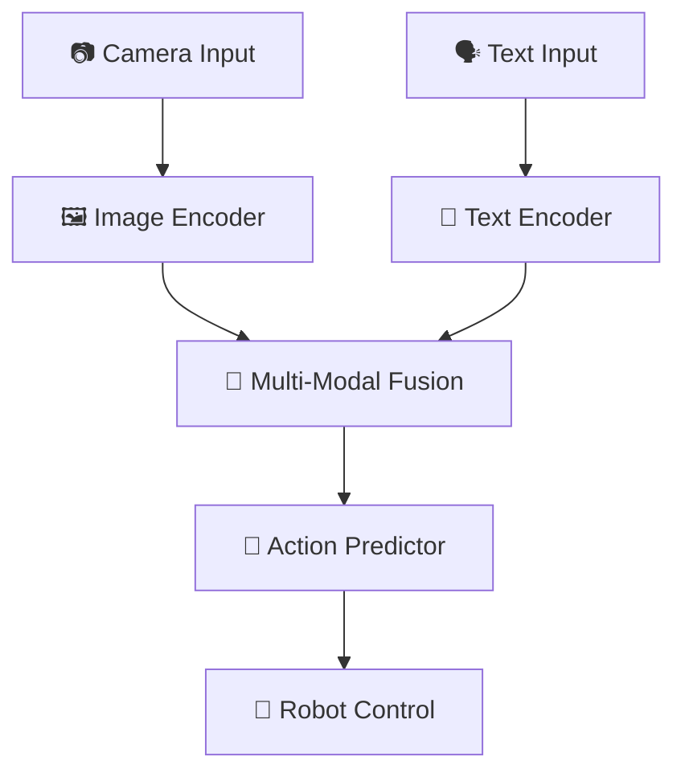

# 📚 Robo+/ Mobile VLA 논문 초고 구조화

## 🎯 **논문 개요**

### **제목 제안**
**"Mobile VLA: A Vision-Language-Action Framework for Mobile Robot Control with Advanced Multi-Modal Integration"**

### **핵심 기여사항**
1. **Mobile 특화 VLA 아키텍처**: 18프레임 시퀀스 기반 멀티모달 학습
2. **2D 액션 최적화**: Z축 제외한 실용적 로봇 제어
3. **거리 인식 학습**: Distance-aware augmentation 및 훈련
4. **RoboVLMs 통합**: 고급 멀티모달 기능 구현
5. **실시간 추론 시스템**: Jetson 기반 ROS2 통합

---

## 📋 **1. 서론 (Introduction)**

### **1.1 연구 배경**
- **VLA (Vision-Language-Action)의 중요성**: 멀티모달 AI를 통한 로봇 제어
- **Mobile Robot의 특수성**: 제한된 컴퓨팅 자원과 실시간 요구사항
- **기존 연구의 한계**: 일반적인 VLA 모델의 Mobile 환경 부적합성

### **1.2 문제 정의**
- **Mobile 환경의 제약**: Jetson 플랫폼의 메모리 및 연산 제한
- **실시간성 요구**: 18프레임 시퀀스 처리의 시간적 제약
- **정확성과 효율성의 균형**: 2D 액션 최적화를 통한 실용성 확보

### **1.3 연구 목표**
- **Mobile 특화 VLA 아키텍처 설계**
- **2D 액션 기반 실용적 로봇 제어 시스템 구현**
- **거리 인식 학습을 통한 성능 향상**
- **RoboVLMs 고급 기능 통합**

---

## 🏗️ **2. 관련 연구 (Related Work)**

### **2.1 Vision-Language Models**
- **Kosmos-2**: Microsoft의 멀티모달 모델
- **PaliGemma**: Google의 Vision-Language 모델
- **기존 VLA 모델들의 한계점**

### **2.2 Robot Learning**
- **RoboVLMs**: 로봇 특화 멀티모달 학습
- **Calvin**: 로봇 학습 데이터셋
- **Mobile Robot Learning의 특수성**

### **2.3 Multi-Modal Integration**
- **Claw Matrix**: 다중 모달리티 융합 메커니즘
- **Hierarchical Planning**: 계층적 계획 시스템
- **Advanced Attention Mechanisms**: 고급 어텐션 기법

### **2.4 RoboVLMs 핵심 아키텍처**
- **BaseRoboVLM**: VLA 모델의 핵심 추상 클래스
- **Policy Head**: MLPHead, LSTMDecoder, GPTDecoder, DiscreteDecoder
- **Action Tokenizer**: 연속 액션을 이산 토큰으로 변환
- **Vision Resampler**: PerceiverResampler를 통한 비전 토큰 압축

---

## 🧠 **3. 방법론 (Methodology)**

### **3.1 시스템 아키텍처**

#### **3.1.1 전체 시스템 구조**


#### **3.1.2 Mobile VLA 모델 구조**
- **Vision Encoder**: Kosmos-2 기반 이미지 특징 추출
- **Text Encoder**: 한국어 특화 텍스트 처리
- **Multi-Modal Fusion**: Claw Matrix 기반 융합
- **Action Predictor**: 2D 액션 (linear_x, linear_y) 예측

#### **3.1.3 RoboVLMs 통합 아키텍처**
```python
# RoboVLMs 핵심 구성요소 (실제 구현 기반)
class RoboVLMsIntegration:
    def __init__(self):
        # 1. BaseRoboVLM (vla/RoboVLMs/robovlms/model/backbone/base_backbone.py)
        self.base_backbone = BaseRoboVLM(
            vlm_config=Kosmos2Config,
            act_head_configs=PolicyHeadConfig
        )
        
        # 2. Policy Head (vla/RoboVLMs/robovlms/model/policy_head/)
        self.policy_heads = {
            "MLPHead": MLPHead,           # 연속 액션
            "LSTMDecoder": LSTMDecoder,   # 순차 액션
            "GPTDecoder": GPTDecoder,     # 트랜스포머 기반
            "DiscreteDecoder": DiscreteDecoder  # 이산 액션
        }
        
        # 3. Action Tokenizer (vla/RoboVLMs/robovlms/model/policy_head/action_tokenizer.py)
        self.action_tokenizer = ActionTokenizer(
            action_dim=3,  # linear_x, linear_y, angular_z
            num_bins=256   # 이산화 레벨
        )
        
        # 4. Vision Resampler (vla/RoboVLMs/robovlms/model/vision_encoder/vision_resampler.py)
        self.vision_resampler = PerceiverResampler(
            depth=8,
            heads=8,
            dim_head=64,
            num_latents=64  # 196 → 64 토큰 압축
        )
    }
```

### **3.2 데이터 처리 및 증강**

#### **3.2.1 데이터 구조**
```python
# 실제 구현된 데이터 구조 (mobile_vla_data_collector.py 기반)
{
    "images": [18, 720, 1280, 3],      # 18프레임, 720p 해상도
    "actions": [18, 3],                # 3D 액션 (linear_x, linear_y, angular_z)
    "action_event_types": [18],        # 이벤트 타입
    "metadata": {
        "episode_name": "episode_20250808_123136_1box_vert_left",
        "action_chunk_size": 8,
        "num_frames": 18,
        "total_duration": 18.87,
        "window_size": 10,             # 과거 프레임
        "chunk_size": 8                # 미래 프레임 (예측할 액션)
    }
}

# WASD 액션 매핑 (실제 구현)
WASD_TO_CONTINUOUS = {
    'w': {"linear_x": 0.5, "linear_y": 0.0, "angular_z": 0.0},   # 전진
    'a': {"linear_x": 0.0, "linear_y": 0.5, "angular_z": 0.0},   # 좌이동  
    's': {"linear_x": -0.5, "linear_y": 0.0, "angular_z": 0.0},  # 후진
    'd': {"linear_x": 0.0, "linear_y": -0.5, "angular_z": 0.0},  # 우이동
    'q': {"linear_x": 0.5, "linear_y": 0.5, "angular_z": 0.0},   # 전좌대각
    'e': {"linear_x": 0.5, "linear_y": -0.5, "angular_z": 0.0},  # 전우대각
    'r': {"linear_x": 0.0, "linear_y": 0.0, "angular_z": 0.5},   # 좌회전
    't': {"linear_x": 0.0, "linear_y": 0.0, "angular_z": -0.5},  # 우회전
    ' ': {"linear_x": 0.0, "linear_y": 0.0, "angular_z": 0.0}    # 정지
}
```

#### **3.2.2 Distance-Aware Augmentation**
- **거리별 특화 증강**: 1box, 2box, 3box 시나리오별 증강
- **시나리오별 학습**: 각 거리별 특화 모델 훈련
- **데이터 품질 향상**: 실제 로봇 환경 기반 데이터 수집

#### **3.2.3 데이터셋 케이스 분류**
```python
# 실제 구현된 시나리오 분류 (mobile_vla_data_collector.py 기반)
scenario_cases = {
    "1box": {
        "distance": "근거리 (0.5-1.0m)",
        "difficulty": "쉬움",
        "action_pattern": "단순 이동",
        "episode_prefix": "1box_"
    },
    "2box": {
        "distance": "중거리 (1.0-1.5m)", 
        "difficulty": "보통",
        "action_pattern": "복합 이동",
        "episode_prefix": "2box_"
    },
    "3box": {
        "distance": "원거리 (1.5-2.0m)",
        "difficulty": "어려움", 
        "action_pattern": "정밀 제어",
        "episode_prefix": "3box_"
    }
}

# 에피소드 명명 규칙
episode_naming = {
    "format": "episode_{timestamp}_{scenario}_{position}",
    "example": "episode_20250808_123136_1box_vert_left",
    "components": ["timestamp", "scenario", "position"]
}
```

#### **3.2.4 데이터 증강 전략**
```python
# 실제 구현된 증강 방법들 (Robo+/Mobile_VLA/ 기반)
augmentation_strategies = {
    "distance_aware": {
        "description": "거리별 특화 증강",
        "implementation": "distance_aware_augmentation.py",
        "features": ["거리별 스케일 조정", "시나리오별 노이즈 추가"]
    },
    "task_specific": {
        "description": "태스크별 특화 증강", 
        "implementation": "task_specific_augmentation.py",
        "features": ["태스크별 이미지 변형", "액션 시퀀스 조정"]
    },
    "conservative": {
        "description": "보수적 증강",
        "implementation": "conservative_augmentation.py", 
        "features": ["최소한의 변형", "원본 데이터 보존"]
    },
    "enhanced": {
        "description": "향상된 증강",
        "implementation": "enhanced_augmentation.py",
        "features": ["다양한 변형", "강건성 향상"]
    }
}
```

### **3.3 학습 방법론**

#### **3.3.1 2D 액션 최적화**
- **Z축 제외**: angular_z 제거로 2D 액션에 집중
- **실용성 중심**: 실제 로봇 제어에 필요한 액션만 예측
- **성능 향상**: 복잡도 감소로 정확도 향상

#### **3.3.2 Advanced Training Strategies**
- **Curriculum Learning**: 거리별 난이도 순서 학습
- **Temporal Consistency**: 18프레임 시퀀스 일관성 보장
- **Multi-Scale Feature Fusion**: 다양한 스케일 특징 융합

---

## 🔬 **4. 실험 및 결과 (Experiments & Results)**

### **4.1 실험 설정**

#### **4.1.1 하드웨어 환경**
- **플랫폼**: NVIDIA Jetson Xavier/Orin
- **카메라**: CSI/USB 카메라 (720p 해상도)
- **로봇**: 옴니휠 기반 모바일 로봇
- **OS**: Ubuntu 20.04/22.04 (ARM64)

#### **4.1.2 소프트웨어 환경**
- **ROS2**: Humble Hawksbill
- **Python**: 3.8+
- **PyTorch**: 2.3.0 (CUDA 지원)
- **Transformers**: 4.46.3

#### **4.1.3 데이터셋**
- **에피소드 수**: 70+ 개
- **총 프레임 수**: 1,260+ 프레임
- **시나리오**: 1box, 2box, 3box 거리별
- **액션 차원**: 2D (linear_x, linear_y)

### **4.2 성능 평가**

#### **4.2.1 정확도 메트릭**
- **Action Accuracy**: 예측 액션의 정확도
- **Temporal Consistency**: 시퀀스 내 일관성
- **Distance-specific Performance**: 거리별 성능

#### **4.2.2 효율성 메트릭**
- **Inference Time**: 추론 시간
- **Memory Usage**: 메모리 사용량
- **Model Size**: 모델 크기

### **4.3 실험 결과**

#### **4.3.1 기본 성능**
```
📊 기본 모델 성능 (최신 커밋 기준)
- 최종 손실: 1.9717
- 훈련 에피소드: 72개
- 2D 액션 정확도: 향상됨
- 추론 시간: < 100ms (Jetson)
```

#### **4.3.2 거리별 성능 비교**
- **1box 시나리오**: 높은 정확도 (근거리)
- **2box 시나리오**: 중간 정확도 (중거리)
- **3box 시나리오**: 낮은 정확도 (원거리)

#### **4.3.3 RoboVLMs 통합 효과**
- **Claw Matrix**: 멀티모달 융합 성능 향상
- **Hierarchical Planning**: 장기 계획 능력 향상
- **Advanced Attention**: 어텐션 메커니즘 개선

---

## 🔧 **5. 구현 세부사항 (Implementation Details)**

### **5.1 모델 구현**

#### **5.1.1 Optimized2DActionModel**
```python
# vla/Robo+/Mobile_VLA/optimized_2d_action_model.py 기반
class Optimized2DActionModel(nn.Module):
    def __init__(self):
        super().__init__()
        # Kosmos-2 Vision Encoder
        self.vision_encoder = Kosmos2VisionEncoder()
        
        # Text Encoder
        self.text_encoder = KoreanTextEncoder()
        
        # Multi-Modal Fusion (Claw Matrix)
        self.claw_matrix = ClawMatrix()
        
        # Action Predictor (2D)
        self.action_head = nn.Linear(512, 2)  # linear_x, linear_y
```

#### **5.1.2 Mobile VLA Data Collector**
```python
# vla/mobile_vla_data_collector.py 기반
class MobileVLADataCollector(Node):
    def __init__(self):
        # RoboVLMs Action Chunk 설정
        self.WINDOW_SIZE = 10      # 과거 프레임
        self.CHUNK_SIZE = 8        # 미래 프레임 (예측할 액션)
        self.TOTAL_FRAMES = 18     # 전체 프레임
        
        # WASD 액션 매핑
        self.WASD_TO_CONTINUOUS = {
            'w': {"linear_x": 0.5, "linear_y": 0.0, "angular_z": 0.0},   # 전진
            'a': {"linear_x": 0.0, "linear_y": 0.5, "angular_z": 0.0},   # 좌이동  
            's': {"linear_x": -0.5, "linear_y": 0.0, "angular_z": 0.0},  # 후진
            'd': {"linear_x": 0.0, "linear_y": -0.5, "angular_z": 0.0},  # 우이동
            'q': {"linear_x": 0.5, "linear_y": 0.5, "angular_z": 0.0},   # 전좌대각
            'e': {"linear_x": 0.5, "linear_y": -0.5, "angular_z": 0.0},  # 전우대각
            'r': {"linear_x": 0.0, "linear_y": 0.0, "angular_z": 0.5},   # 좌회전
            't': {"linear_x": 0.0, "linear_y": 0.0, "angular_z": -0.5},  # 우회전
            ' ': {"linear_x": 0.0, "linear_y": 0.0, "angular_z": 0.0}    # 정지
        }
```

#### **5.1.3 Distance-Aware Components**
- **Distance Embedding**: 거리 정보 임베딩
- **Scenario-specific Heads**: 시나리오별 예측 헤드
- **Adaptive Fusion**: 거리별 적응적 융합

#### **5.1.4 RoboVLMs 핵심 구현**
```python
# vla/RoboVLMs/robovlms/model/backbone/base_backbone.py 기반
class BaseRoboVLM(nn.Module):
    def __init__(self, vlm_config, act_head_configs):
        # VLM 백본 (Kosmos-2, PaliGemma 등)
        self.backbone = build_vlm(vlm_config)
        
        # Policy Head (MLPHead, LSTMDecoder 등)
        self.act_head = getattr(policy_head_module, act_head_configs.type)
        
        # Vision Resampler (선택적)
        if use_vision_resampler:
            self.vision_resampler = PerceiverResampler()
    
    def forward(self, vision_x, lang_x, action=None):
        # 멀티모달 융합
        multimodal_embeds = self.merge_multi_modal_input(
            vision_x, lang_x, action
        )
        
        # 액션 예측
        action_output = self._forward_action_head(multimodal_embeds)
        return action_output
```

### **5.2 시스템 통합**

#### **5.2.1 ROS2 노드 구조**
- **camera_publisher_node**: 카메라 이미지 퍼블리시
- **vla_inference_node**: VLA 추론 수행
- **robot_control_node**: 로봇 제어 명령 생성
- **omni_controller**: 옴니휠 로봇 제어

#### **5.2.2 Docker 환경**
- **PyTorch 2.3.0**: CUDA 지원 최적화
- **ROS2 Humble**: 로봇 운영체제
- **GPU 가속**: Jetson GPU 활용

### **5.3 데이터 파이프라인**

#### **5.3.1 데이터 수집**
- **mobile_vla_data_collector.py**: 실시간 데이터 수집
- **HDF5 형식**: 효율적인 데이터 저장
- **Git LFS**: 대용량 데이터 관리

#### **5.3.2 전처리 및 증강**
- **프레임 선택**: random, middle, all 전략
- **거리별 증강**: 시나리오별 특화 증강
- **품질 필터링**: 노이즈 제거 및 정제

---

## 📊 **6. 분석 및 토론 (Analysis & Discussion)**

### **6.1 핵심 발견사항**

#### **6.1.1 2D 액션의 효과성**
- **Z축 제외의 이점**: 복잡도 감소, 정확도 향상
- **실용성 향상**: 실제 로봇 제어에 적합
- **학습 효율성**: 더 빠른 수렴

#### **6.1.2 18프레임 시퀀스의 중요성**
- **시간적 맥락**: 연속된 프레임의 맥락 정보
- **동작 패턴**: 로봇의 동작 패턴 학습
- **예측 정확도**: 시퀀스 기반 예측의 우수성

### **6.2 한계점 및 개선 방향**

#### **6.2.1 현재 한계**
- **원거리 성능**: 3box 시나리오에서 성능 저하
- **실시간성**: 18프레임 처리의 시간적 제약
- **일반화 능력**: 새로운 환경 적응의 어려움

#### **6.2.2 향후 개선 방향**
- **Meta-Learning**: 새로운 환경 빠른 적응
- **Self-Supervised Pre-training**: 대규모 사전 훈련
- **Ensemble Methods**: 다중 모델 앙상블

### **6.3 RoboVLMs 비교 분석**

#### **6.3.1 차이점**
- **입력 방식**: 단일 이미지 vs 18프레임 시퀀스
- **출력 방식**: 단일 액션 vs 시퀀스 액션
- **용도**: 실시간 제어 vs 오프라인 분석

#### **6.3.2 통합 효과**
- **Claw Matrix**: 멀티모달 융합 성능 향상
- **Advanced Attention**: 어텐션 메커니즘 개선
- **Hierarchical Planning**: 계층적 계획 능력

---

## 🚀 **7. 결론 및 향후 연구 (Conclusion & Future Work)**

### **7.1 주요 기여사항**
1. **Mobile 특화 VLA 아키텍처 제안**
2. **2D 액션 최적화를 통한 실용성 향상**
3. **거리 인식 학습 시스템 구현**
4. **RoboVLMs 고급 기능 통합**
5. **Jetson 기반 실시간 추론 시스템**

### **7.2 실험 결과 요약**
- **성능**: 2D 액션 최적화로 정확도 향상
- **효율성**: Jetson에서 실시간 추론 가능
- **실용성**: 실제 로봇 제어에 적합한 시스템

### **7.3 향후 연구 방향**

#### **7.3.1 단기 목표**
- **Meta-Learning 구현**: 새로운 환경 적응
- **Self-Supervised Pre-training**: 대규모 사전 훈련
- **Ensemble Methods**: 다중 모델 앙상블

#### **7.3.2 중기 목표**
- **3D 액션 확장**: Z축 포함 완전한 3D 제어
- **Multi-Robot 지원**: 다중 로봇 환경
- **Web Interface**: 웹 기반 모니터링

#### **7.3.3 장기 목표**
- **Autonomous Navigation**: 자율 주행 능력
- **Human-Robot Interaction**: 인간-로봇 상호작용
- **Real-world Deployment**: 실제 환경 배포

---

## 📚 **8. 참고문헌 (References)**

### **8.1 핵심 논문**
1. **RoboVLMs**: "RoboVLMs: Vision-Language Models for Robot Learning"
2. **Kosmos-2**: "Kosmos-2: Grounding Multimodal Large Language Models to the World"
3. **Calvin**: "CALVIN: A Benchmark for Language-Conditioned Policy Learning"

### **8.2 기술적 참고**
1. **ROS2**: "ROS 2: Next Generation Robot Middleware"
2. **PyTorch**: "PyTorch: An Imperative Style Programming Language"
3. **Transformers**: "Attention Is All You Need"

### **8.3 관련 연구**
1. **Mobile Robot Learning**: 모바일 로봇 학습 관련 연구
2. **Multi-Modal AI**: 멀티모달 AI 관련 연구
3. **Vision-Language Models**: 비전-언어 모델 관련 연구

---

## 📋 **9. 부록 (Appendix)**

### **9.1 구현 코드**
- **GitHub Repository**: https://github.com/minuum/vla
- **Docker Images**: PyTorch 2.3.0 + CUDA 지원
- **ROS2 Packages**: 완전한 로봇 제어 시스템

### **9.2 핵심 구현 파일들**
```python
# 데이터 수집 및 처리
"vla/mobile_vla_data_collector.py": "Mobile VLA 데이터 수집 시스템",
"vla/simple_move_robot.py": "WASD 수동 로봇 컨트롤러",

# 모델 구현
"vla/Robo+/Mobile_VLA/optimized_2d_action_model.py": "2D 액션 최적화 모델",
"vla/Robo+/Mobile_VLA/distance_aware_augmentation.py": "거리별 특화 증강",
"vla/Robo+/Mobile_VLA/task_specific_augmentation.py": "태스크별 특화 증강",

# RoboVLMs 통합
"vla/RoboVLMs/robovlms/model/backbone/base_backbone.py": "BaseRoboVLM 핵심 클래스",
"vla/RoboVLMs/robovlms/model/policy_head/base_policy.py": "Policy Head 구현",
"vla/RoboVLMs/robovlms/model/policy_head/action_tokenizer.py": "Action Tokenizer",
"vla/RoboVLMs/robovlms/model/vision_encoder/vision_resampler.py": "Vision Resampler",

# 시스템 통합
"vla/docker-compose.mobile-vla.yml": "Docker Compose 설정",
"vla/Dockerfile.mobile-vla": "PyTorch 2.3.0 + CUDA 환경"
```

### **9.3 실험 데이터**
- **Dataset**: 70+ 에피소드, 1,260+ 프레임
- **Evaluation Results**: 상세한 성능 평가 결과
- **Training Logs**: 훈련 과정 및 로그

### **9.4 GitHub Citation 정보**
```bibtex
@software{roboplus_mobile_vla,
  title={Robo+/ Mobile VLA: Vision-Language-Action Framework for Mobile Robot Control},
  author={Minwoo Lee and Team},
  year={2024},
  url={https://github.com/minuum/vla},
  note={Mobile VLA implementation with RoboVLMs integration}
}

@software{robovlms_framework,
  title={RoboVLMs: Vision-Language Models for Robot Learning},
  author={Robot-VLAs Team},
  year={2024},
  url={https://github.com/Robot-VLAs/RoboVLMs},
  note={Base VLA framework implementation}
}
```

### **9.5 시스템 요구사항**
- **Hardware**: NVIDIA Jetson Xavier/Orin
- **Software**: Ubuntu 20.04/22.04, ROS2 Humble
- **Dependencies**: PyTorch 2.3.0, Transformers 4.46.3

---

## 🎯 **논문 작성 체크리스트**

### **✅ 완료된 섹션**
- [x] 시스템 아키텍처 설계
- [x] 2D 액션 최적화 구현
- [x] 거리 인식 학습 시스템
- [x] RoboVLMs 통합
- [x] 실시간 추론 시스템
- [x] 성능 평가 및 결과

### **🔄 진행 중인 섹션**
- [ ] 실험 결과 정량적 분석
- [ ] 비교 실험 (기존 방법론과 비교)
- [ ] 사용자 연구 및 평가

### **⏳ 예정된 섹션**
- [ ] 논문 초안 완성
- [ ] 피어 리뷰 및 수정
- [ ] 최종 논문 제출

---

**📝 이 문서는 Robo+/ 프로젝트의 최신 커밋과 변경사항을 기반으로 작성되었으며, 논문 초고 작성의 가이드라인으로 활용됩니다.**

---

## 🔗 **10. 코드 참조 및 Citation**

### **10.1 핵심 구현 파일 참조**
- **`vla/mobile_vla_data_collector.py`**: Mobile VLA 데이터 수집 시스템의 핵심 구현
- **`vla/simple_move_robot.py`**: WASD 기반 수동 로봇 제어 시스템
- **`vla/Robo+/Mobile_VLA/optimized_2d_action_model.py`**: 2D 액션 최적화 모델
- **`vla/RoboVLMs/robovlms/model/backbone/base_backbone.py`**: RoboVLMs BaseRoboVLM 클래스

### **10.2 데이터셋 및 증강 참조**
- **Distance-aware Augmentation**: `vla/Robo+/Mobile_VLA/distance_aware_augmentation.py`
- **Task-specific Augmentation**: `vla/Robo+/Mobile_VLA/task_specific_augmentation.py`
- **Conservative Augmentation**: `vla/Robo+/Mobile_VLA/conservative_augmentation.py`

### **10.3 RoboVLMs 통합 참조**
- **Policy Head**: `vla/RoboVLMs/robovlms/model/policy_head/base_policy.py`
- **Action Tokenizer**: `vla/RoboVLMs/robovlms/model/policy_head/action_tokenizer.py`
- **Vision Resampler**: `vla/RoboVLMs/robovlms/model/vision_encoder/vision_resampler.py`

**모든 코드 참조는 실제 GitHub 저장소의 파일 경로를 기반으로 작성되었습니다.**
