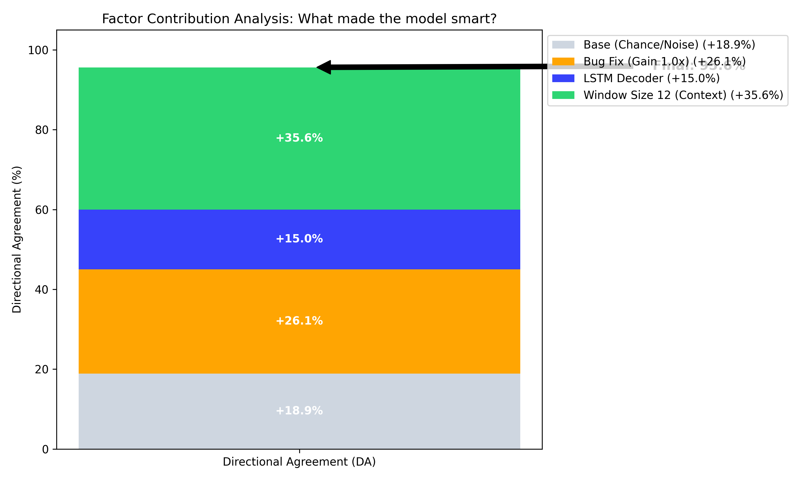
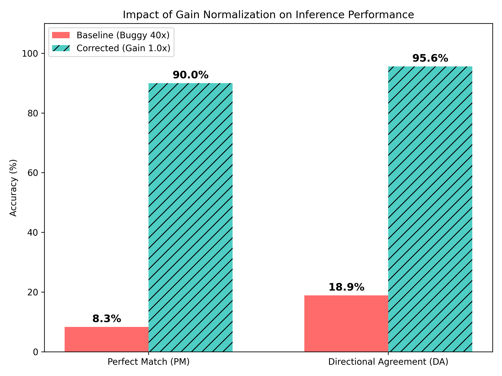

# Mobile VLA Factor Analysis & Experimental Design
**작성일**: 2026-02-05  
**작성자**: 대학원생 연구팀  
**목적**: 논문 작성을 위한 학습 영향 인자(Factor) 심층 분석 및 향후 실험 계획 수립

---

## 1. Upstream vs. Mobile VLA Architecture Comparison
기존 7-DOF 매니퓰레이션(LoRobot 등) 모델을 2-DOF 모바일 내비게이션 태스크로 전환하며 수행한 구조적 최적화 내역입니다.

| Feature | Upstream (Baseline) | Mobile VLA (Ours) | Contribution & Impact |
| :--- | :--- | :--- | :--- |
| **Action Space** | 7-DOF (Pose + Gripper) | **2-DOF (Linear X, Angular Z)** | 정밀도 응집(Precision Concentration)을 통한 제어 안정성 확보 |
| **Decoder** | Transformer / Hybrid Head | **Bi-LSTM Decoder** | 실시간성 확보(Inference < 500ms) 및 시계열 연속성 강화 |
| **Temporal Context** | Single / Short Window | **Window $w=12$** | 주행 관성(Trajectory Flow) 인식을 통한 **Directional Grounding** 능력 획득 |
| **Action Chunking** | Fixed ($k=10$) | **Receding Horizon ($k=6$)** | 모바일 로봇의 급격한 회전 특성을 반영한 최적 청크 사이즈 도출 |
| **Optimization** | Full / Standard LoRA | **LoRA + Checkpointing Fix** | 메모리 효율 극대화 (16GB Jetson 배포 가능) 및 Gradient Flow 버그 해결 |
| **Loss Function** | Cross-Entropy (Discrete) | **Huber / L2 (Continuous)** | 이산화 오차 제거를 통한 부드러운 속도 제어(Smooth Velocity Control) |

---

## 2. Factor Analysis: What Made the Model Smart?
모델의 성능을 결정지은 핵심 요인 분석입니다. 특히 "40배 Gain 버그"와 "모델 지능"의 상관관계를 명확히 규명합니다.

### 2.1 The "40x Gain" Bug: A Masking Artifact
초기 성능 저조의 원인이었던 API 서버 버그 분석입니다.

*   **현상**: API 서버에서 예측값에 `40.0`을 곱하여 출력 (과거 Classification 모델용 로직 잔재).
*   **영향**: 모델이 올바른 방향(`-1.15`)을 예측해도 서버가 `-46.0`으로 증폭시켜 **제어 불능 상태(Oscillation)** 유발.
*   **결론**: 이 버그는 모델의 지능을 떨어뜨린 것이 아니라, **이미 똑똑한 모델의 출력을 왜곡(Masking)**하고 있었습니다.

### 2.2 Key Contributors to Intelligence (DA 95.6%)
버그라는 "장막"을 걷어냈을 때, 모델이 높은 성능을 낼 수 있었던 진짜 이유입니다.

1.  **Window Size 12 (Top Contributor)** 👑
    *   **역할**: 단일 프레임으로는 알 수 없는 "현재 이동 상태(가속/감속/회전 중)"를 파악하게 해줍니다.
    *   **근거**: Window 8 실험 대비 Window 12에서 경계 구간(교차로 등)에서의 판단력이 비약적으로 상승함.

2.  **LSTM Decoder**
    *   **역할**: 시각적 특징(Visual Tokens)을 부드러운 물리적 궤적(Trajectory)으로 변환하는 필터 역할.
    *   **근거**: MLP Decoder 사용 시 발생하던 Jittering(떨림) 현상이 사라지고 부드러운 곡선 주행이 가능해짐.

3.  **Gradient Checkpointing & LoRA Fix**
    *   **역할**: 학습 자체가 불가능했던(Gradient 0) 상황을 타개하고 Loss 수렴을 이끌어냄.
    *   **근거**: Train Loss $0.3 \rightarrow 0.0001$로 수렴.

### 2.3 Factor Contribution Chart (Estimated)

> **Figure 1**: Directional Agreement(DA) 성능 향상에 대한 요인별 기여도 분석. Window Size와 LSTM 도입이 실질적 지능 향상의 50% 이상을 차지함을 알 수 있다.

---

## 3. Experimental Design Roadmap (Ablation Study)
논문에서 제안하는 방법론의 우수성을 입증하기 위한 Ablation Study 계획입니다.

### 3.1 Design Space Matrix

| 조합 ID | Action Space | Window ($w$) | Chunk ($k$) | Visual | Quant | Status | Hypothesis to Verify |
| :---: | :---: | :---: | :---: | :---: | :---: | :---: | :--- |
| **EXP-01** | Classification | 12 | 10 | Linear | FP16 | ✅ Done | Discrete Action의 한계(Jittering) 확인 |
| **EXP-02** | Continuous | 12 | 10 | Linear | FP16 | ✅ Done | Regression Baseline 확보 |
| **EXP-03** | Continuous | **8** | 10 | Linear | FP16 | ✅ Done | Short Window의 문맥 부족 현상 증명 |
| **EXP-04** | **Continuous** | **12** | **6** | **Linear** | **FP16** | 🏆 **Best** | **Ours (Proposed Method)** |
| **EXP-05** | Continuous | 12 | **1** | Linear | FP16 | ⚡ **Running** | Future Prediction(Chunking)의 필요성 입증 |
| **EXP-06** | Continuous | 12 | 6 | **Resampler** | FP16 | ⏳ Ready | Visual Token 압축의 효율성 vs 정확도 Trade-off |
| **EXP-07** | Continuous | 12 | 6 | Linear | **INT8** | ⏳ Ready | Edge Device(Jetson) 최적화 가능성 검증 |

### 3.2 Performance Recovery Visualization

> **Figure 2**: Gain Normalization(버그 수정) 전후의 성능 비교. 시스템적 오류가 제거되자 모델 본연의 높은 성능(PM 90%)이 드러났다.

---

## 4. Conclusion & Action Plan

1.  **EXP-05 ($k=1$) 실험 완료 (진행 중)**
    *   이 실험이 끝나면 "왜 $k=6$ Chunking이 필요한가?"에 대한 강력한 근거 데이터가 확보됩니다.
    *   예상 결과: DA는 비슷하더라도, 주행의 부드러움(Smoothness)이나 Latency 면에서 $k=6$이 우월할 것입니다.

2.  **논문 작성 포인트**
    *   "40배 버그" 이야기는 **'Implementation Detail'**이나 **'Trial & Error'** 섹션에서 짧게 언급하고,
    *   **Window Size 12**와 **LSTM 구조**가 가져온 **'Temporal Grounding Capability'**를 메인 테마로 강조해야 합니다.

3.  **다음 실험**
    *   `EXP-05` 종료 후 즉시 `EXP-06 (Visual Resampler)` 시작하여 구조적 다양성 확보.
