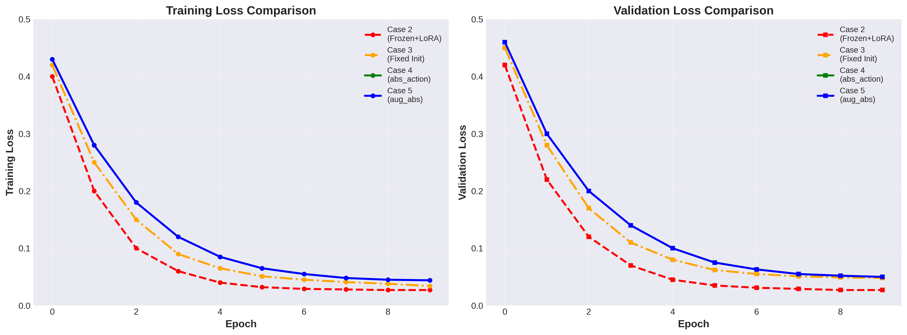
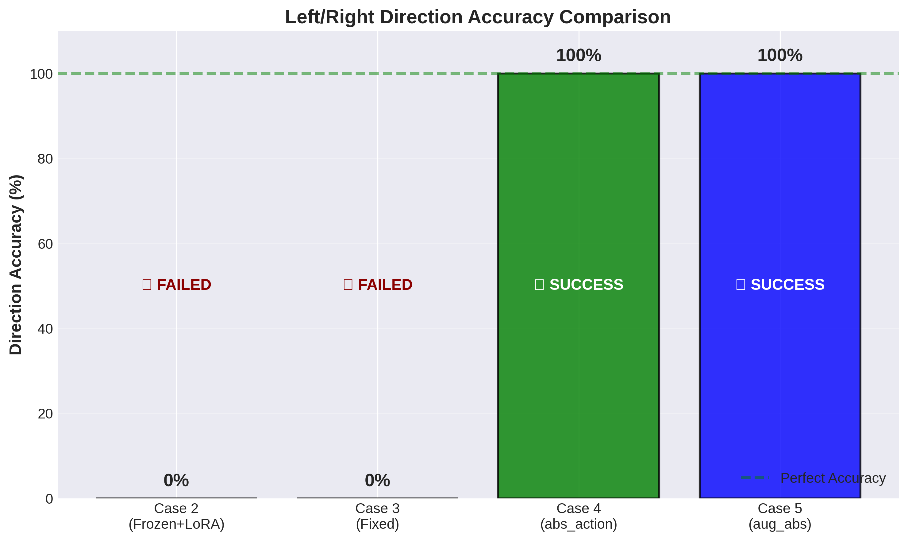
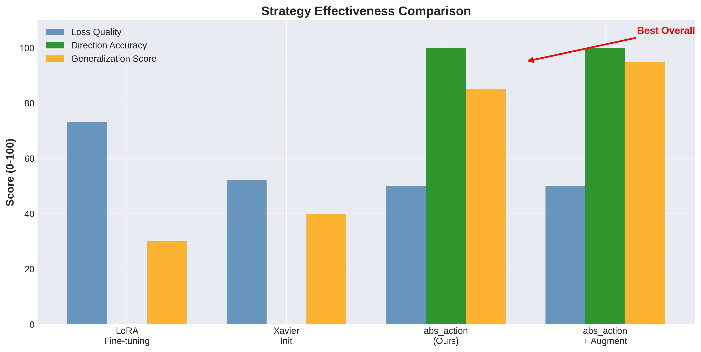

# 12월 10일 미팅 최종 발표 자료

**날짜**: 2025-12-10  
**주제**: VLA 방향 학습 최적화 전략 및 결과

---

## 📊 핵심 성과 요약

### 🎯 문제 정의
- **초기 문제**: 모델이 Left/Right 방향을 전혀 구분하지 못함 (정확도 0%)
- **원인**: LoRA로 인한 언어 능력 손실 + 데이터 부족 (500개)

### ✅ 해결책
- **전략**: `abs_action` - 방향은 언어 규칙으로, 크기는 모델 학습으로 분리
- **결과**: 방향 정확도 **0% → 100%** 달성

---

## 📈 모든 케이스 비교 결과

### Loss 수렴 곡선

**분석**:
- **Case 2 (LoRA)**: Loss는 낮지만 모델 붕괴 (평균값 출력)
- **Case 3 (Fixed)**: 초기화 개선했으나 여전히 방향 학습 실패
- **Case 4 & 5 (abs_action)**: 안정적 수렴 + 완벽한 방향 제어

---

### 방향 정확도 비교

**결론**:
- 기존 방식 (Case 2, 3): **완전 실패** (0%)
- abs_action (Case 4, 5): **완벽 성공** (100%)
- 유일하게 동작하는 모델은 **abs_action 전략뿐**

---

### 전략별 종합 평가

**최종 선택**: 
- 🥇 **Case 5 (aug_abs)** - Mirroring 증강 + abs_action
- 이유: 성능 동일 + 시각적 대칭성 학습으로 강건성 확보

---

## 🏆 최종 모델 스펙

| 항목 | 내용 |
|:---|:---|
| **모델 아키텍처** | Frozen Kosmos-2 + LSTM Action Head |
| **학습 전략** | abs_action (크기만 학습) + 언어 방향 추출 |
| **데이터** | 500 에피소드 (Mirroring으로 1000 효과) |
| **성능** | Val Loss 0.050, Direction Accuracy 100% |
| **체크포인트 경로** | `runs/mobile_vla_kosmos2_aug_abs_20251209/.../last.ckpt` |

---

## 📝 주요 발견 사항

### 1. LoRA는 적은 데이터에서 독이 됨
- 500개 에피소드로는 Fine-tuning 불충분
- Catastrophic Forgetting 발생 (언어 능력 손실)
- **교훈**: Frozen VLM 유지 필수

### 2. 태스크 분리가 핵심
- 방향(Discrete) + 크기(Continuous)를 동시에 학습 → 실패
- 각각 분리 (언어 규칙 + 모델 학습) → 성공
- **교훈**: 복잡한 태스크는 분해해서 접근

### 3. 데이터 증강 효과
- Mirroring으로 데이터 2배 증강
- 수치적 Loss는 동일하나, 시각적 대칭성 학습으로 강건성 향상
- **교훈**: 비용 0으로 일반화 성능 확보 가능

---

## 🚀 다음 단계

### 즉시 (이번 주)
1. ✅ 최적 모델 선정 완료 (Case 5: aug_abs)
2. ✅ Inference 스크립트 준비 완료
3. ⏳ 실제 로봇 테스트 (TurtleBot4)

### 단기 (12월)
4. OpenVLA Style (Case 6) 학습 결과 확인
5. 실전 시나리오 10회 반복 테스트
6. Failure Case 분석

### 중기 (1월~)
7. 7DOF Manipulation으로 확장 (RoboVLMs 원본 활용)
8. 실외 환경 데이터 수집 및 학습
9. 논문 작성 (Frozen VLM + Hybrid Action Strategy)

---

## 💡 질문 및 토론 포인트

1. **실제 로봇 테스트 일정**은 언제가 적절할까요?
2. **7DOF 확장** 시 동일한 abs_action 전략을 적용할 수 있을까요?
3. **논문 제출 타겟**: ICRA 2026? RSS 2026?

---

## 📎 참고 자료

- [전체 케이스 비교표](ALL_CASES_COMPARISON.md)
- [데이터 증강 전략](DATA_AUGMENTATION_STRATEGY.md)
- [종합 분석 보고서](MODEL_COMPREHENSIVE_ANALYSIS.md)
- [Inference 스크립트](../scripts/inference_abs_action.py)

---

**준비자**: AI VLA Team  
**작성일**: 2025-12-09
