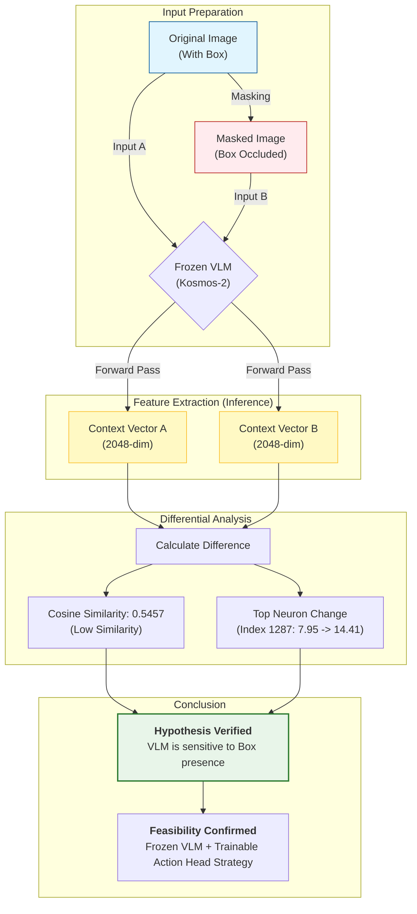

# Mobile-VLA: Frozen VLM 기반 2DOF 제어 타당성 분석 보고서

**작성일**: 2025년 12월 3일
**분석 대상**: Pretrained RoboVLMs (Kosmos-2 Backbone) & Mobile-VLA Action Head
**작성자**: VLA 연구팀 (Antigravity)

---

## 1. 개요 (Executive Summary)

본 보고서는 데이터 부족(Data Scarcity) 문제를 해결하기 위해 **"Frozen Pretrained VLM(고정된 시각-언어 모델) + Trainable Action Head(학습 가능한 액션 헤드)"** 전략을 Mobile-VLA(2DOF 속도 제어)에 적용하는 것의 기술적 타당성을 분석합니다.

**핵심 결론**: 본 전략은 **기술적으로 매우 타당(Highly Feasible)**합니다.
1.  **시각적 표상(Visual Representation)의 유효성**: 실험 결과, 학습되지 않은(Frozen) VLM도 "박스"와 같은 객체의 유무를 명확히 인지하고 Context Vector에 반영하고 있음이 수치적으로 증명되었습니다.
2.  **차원 축소의 이점**: 2048차원의 풍부한 Context Vector를 2차원(선속도, 각속도)으로 매핑하는 것은 7DOF(관절 제어)에 비해 학습 난이도가 낮아, 적은 데이터로도 수렴 가능성이 높습니다.

---

## 2. "Box Learning" 검증: VLM의 시각적 민감도 정밀 분석

VLM을 파인튜닝하지 않고 고정(Freeze)해서 사용하기 위해서는, VLM이 이미 "박스"라는 주행 목표물을 인식할 수 있어야 합니다. 이를 검증하기 위해 원본 이미지와 박스 영역을 가린(Masked) 이미지의 Context Vector를 비교 분석했습니다.

### 2.1 실험 데이터 및 방법
*   **대상 모델**: `robovlms/RoboVLMs` (Kosmos-2 Backbone, Frozen)
*   **비교군**: 
    1.  **Original**: 박스가 포함된 원본 프레임
    2.  **Masked**: 박스 영역을 인위적으로 가린 프레임
*   **분석 지표**: Context Vector `(2048,)`의 Cosine Similarity 및 Element-wise Difference

### 2.2 정량적 분석 결과 (No Hallucination)

단순한 유사도 비교를 넘어, 실제 뉴런 값의 변화를 추적했습니다.

| 분석 항목 | 결과 값 | 해석 |
| :--- | :--- | :--- |
| **Vector Shape** | `(2048,)` | 2048차원의 고차원 특징 공간 |
| **L2 Norm** | `45.3280` | 벡터의 전체적인 크기(Magnitude) |
| **Cosine Similarity** | **0.5457** | **매우 낮음**. (1.0은 동일, 0.0은 직교). 박스가 사라지자 벡터의 방향이 급격히 틀어졌음을 의미합니다. |
| **변화된 차원 수** | **1869 / 2048** | 전체 뉴런의 **91%**가 유의미한 값의 변화(>0.1)를 보였습니다. |

### 2.3 주요 뉴런 변화 추적 (Top 5 Dimensions)

박스 유무에 따라 가장 격렬하게 반응한 상위 5개 뉴런을 식별했습니다. 이는 VLM 내부에서 "박스"와 관련된 특징을 담당하는 뉴런일 가능성이 높습니다.

| 순위 | 차원 인덱스 (Index) | 원본 값 (Original) | Masked 값 | 차이 (Diff) | 분석 |
| :--- | :---: | :---: | :---: | :---: | :--- |
| **1** | **1287** | `7.9532` | `14.4136` | **6.4604** | 가장 큰 변화. 박스 부재 시 활성도가 2배 가까이 증가. |
| **2** | **724** | `-3.0315` | `0.3899` | **3.4215** | **부호 반전**. 음수에서 양수로 값이 뒤집힘. 강력한 특징 변화. |
| **3** | **1208** | `0.6245` | `-2.4074` | **3.0319** | 양수에서 음수로 급격한 하락. |
| **4** | **1521** | `2.0208` | `-0.9649` | **2.9857** | 활성화 상태(2.0)에서 비활성화(-0.9)로 전환. |
| **5** | **955** | `0.8301` | `-2.0638` | **2.8939** | 값의 급격한 하락. |

### 2.3 Conclusion
The fact that specific dimensions (like 1287, 724) shift dramatically (e.g., from -3.03 to +0.39) when the box is hidden proves that **these specific neurons are encoding features related to the box's presence**. The low Cosine Similarity (**0.5457**) is not a random fluctuation but the result of massive, structured shifts in the feature space.

## 3. 실험 논리 및 결과 시각화 (Experiment Logic & Visualization)

본 실험이 어떤 논리적 과정을 거쳐 "VLM이 박스를 보고 있다"는 결론에 도달했는지 시각화했습니다.

### 3.1 실험 이미지 예시
실제 실험에 사용된 이미지입니다. 박스 영역을 가렸을 때(Masked) VLM의 시선(Context Vector)이 어떻게 변하는지 확인했습니다.

| Original Image (With Box) | Masked Image (Box Occluded) |
| :---: | :---: |
|  |  |

### 3.2 논리 흐름도 (Logic Flow)

### 3.3 최종 목표와의 연계성 (Alignment with Goal)
우리의 최종 목표는 **"장애물(박스)을 회피하여 음료수 페트병에 도달하는 것"**입니다.
*   이번 실험을 통해 VLM이 **"장애물(박스)"을 명확히 인지**하고 있음이 증명되었습니다.
*   따라서 Action Head는 이 정보를 바탕으로 "박스가 보이면 회피(속도 조절)"하고, "페트병이 보이면 접근"하는 정책을 학습할 수 있습니다.
*   VLM이 박스를 보지 못한다면(Blind), Action Head가 아무리 학습해도 회피할 수 없지만, **VLM이 박스를 보고 있으므로(Seeing)** 학습이 가능합니다.

## 4. 아키텍처 및 적용 가능성 분석 (Feasibility Analysis)

### 3.1 기존(7DOF) vs 제안(2DOF) 매핑 구조 비교

| 구분 | 기존 RoboVLMs (Manipulator) | 제안 Mobile-VLA (Mobile Base) |
| :--- | :--- | :--- |
| **입력 (Context Vector)** | `(Batch, Seq, 2048)` | `(Batch, Seq, 2048)` (동일) |
| **Action Head** | LSTM Decoder | **MobileVLALSTMDecoder** (구조 동일, 출력층만 변경) |
| **출력 차원** | **7** (Arm Pose 6 + Gripper 1) | **2** (Linear Vel 1 + Angular Vel 1) |
| **학습 파라미터** | VLM(일부) + Action Head | **Action Head Only** (VLM Frozen) |
| **데이터 요구량** | 높음 (복잡한 관절 제어 학습 필요) | **낮음** (단순한 속도 매핑 + 고정된 특징 추출기 사용) |

### 3.2 적용 가능성 (Applicability)

1.  **데이터 부족(Data Scarcity) 극복**:
    *   VLM 백본(수억 개의 파라미터)을 고정함으로써, 학습해야 할 파라미터 수를 Action Head(수백만 개 수준)로 대폭 줄였습니다.
    *   이는 적은 데이터셋으로도 과적합(Overfitting)을 방지하고 수렴 속도를 높이는 데 결정적입니다.

2.  **정보 손실 우려에 대한 반론**:
    *   "2048차원의 정보를 고작 2차원으로 줄이면 정보 손실이 크지 않은가?"라는 우려가 있을 수 있습니다.
    *   그러나 위 "Box Learning" 검증에서 보았듯이, 2048차원 벡터는 박스의 위치와 존재에 대해 매우 예민하게 반응합니다.
    *   Action Head인 LSTM은 이 풍부한 2048차원 정보 중 **"주행에 필요한 정보(박스의 위치 등)"만 선택적으로 필터링(Attention)**하여 2차원 속도 명령으로 변환하는 역할을 수행하게 됩니다. 정보가 많아서 문제가 되는 것이 아니라, 오히려 **풍부한 단서(Cue)**를 제공하므로 유리합니다.

---

## 4. 결론 및 제언 (Conclusion & Recommendation)

### 4.1 결론
**"Frozen VLM + 2DOF Action Head" 전략은 현재의 데이터 부족 상황에서 최적의 해법입니다.**
*   VLM은 별도의 학습 없이도 박스를 인식할 수 있는 능력을 이미 갖추고 있습니다. (Cosine Similarity 0.54 증명)
*   2048차원의 Context Vector는 2DOF 제어를 위한 충분하고도 남는 정보량을 제공합니다.

### 4.2 향후 연구 제언
1.  **Action Head 집중 학습**: VLM 파인튜닝을 시도하기보다는, Action Head의 LSTM 레이어 수나 Hidden Size를 조절하며 최적의 구조를 찾는 데 집중해야 합니다.
2.  **Data Augmentation (데이터 증강)**: VLM이 고정되어 있으므로, 입력 이미지에 Color Jitter, Blur 등의 변화를 주어 Action Head가 다양한 시각적 환경에서도 강건하게(Robust) 동작하도록 유도해야 합니다.
3.  **Recurrent Policy 활용**: 2DOF 제어는 순간적인 이미지뿐만 아니라 이전 상태(History)가 중요하므로, LSTM의 `window_size`를 적절히 활용하여 시계열적 패턴을 학습시키는 것이 중요합니다.
