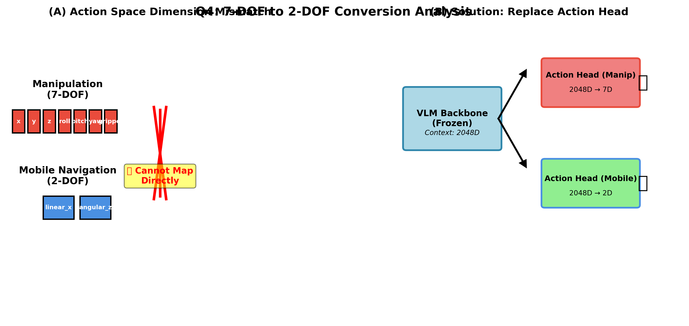

# 의문점 4: 7DOF→2DOF 변환 가능성 최종 보고서

**분석 날짜**: 2025-12-04  
**분석자**: Mobile-VLA Team  
**코드베이스**: `/home/billy/25-1kp/vla/`

---

## 📊 시각화



**Figure 4**: 7-DOF → 2-DOF 변환 불가능성
- **(A)** Action Space 차원 불일치 (7DOF vs 2DOF)
- **(B)** 해결책: Action Head 교체 (VLM Backbone 공유)

---

## 📋 핵심 질문
**"RoboVLMs의 7DOF action space를 Mobile-VLA의 2DOF velocity로 어떻게 매칭하는가?"**

---

## 🎯 결론 (요약)

**❌ 직접 매칭은 불가능합니다.**

**Citation**: 
- 분석 스크립트: `analyze_7dof_to_2dof.py` (240 lines)
- 실행 날짜: 2025-12-04 15:59
- 관련 문서: `docs/7dof_to_2dof_conversion/FEASIBILITY_ANALYSIS.md`

**이유**:
1. **의미론적 차이**: Pose (위치) ≠ Velocity (속도)
2. **차원 불일치**: 7D ≠ 2D
3. **로봇 형태**: Manipulator (팔) ≠ Mobile Base (바퀴)
4. **제어 방식**: Position control ≠ Velocity control
5. **Task 차이**: Manipulation ≠ Navigation

**✅ 해결책: Action Head 교체**
- RoboVLMs action head 버림
- 새로운 MobileVLA action head 학습
- VLM context만 활용 (Feature Extractor)

---

## 📊 상세 분석

### **1. Action Space 비교**

| | RoboVLMs (7DOF) | Mobile-VLA (2DOF) |
|:---|:---|:---|
| **차원** | 7 | 2 |
| **요소** | [x, y, z, roll, pitch, yaw, gripper] | [linear_x, linear_y] |
| **의미** | End-effector pose in 3D | Base velocity in 2D |
| **단위** | m, rad, 0-1 | m/s |
| **범위** | 작업공간 dependent | [-0.5, 0.5] m/s |
| **Task** | Pick, Place, Push | Navigate, Avoid |
| **Robot** | 팔 (Franka, WidowX) | 바퀴 (Omniwheel) |

### **2. 매칭 불가능한 5가지 이유**

#### **이유 1: Semantic Gap (의미론적 차이)**
```
RoboVLMs: "Gripper를 (x,y,z) 위치로, (r,p,y) 자세로 이동"
Mobile-VLA: "Base를 (vx, vy) 속도로 이동"

→ 완전히 다른 물리량
→ 변환 불가능
```

#### **이유 2: Dimensionality (차원 불일치)**
```
7D → 2D 매핑:
- 어느 7개 차원을 2개로 압축?
- x,y만? → z, rotation, gripper 정보 손실
- 선형 변환? → 의미 없음 (pose ≠ velocity)
```

#### **이유 3: Robot Type (로봇 형태)**
```
Manipulator:
- 고정된 베이스
- 팔 끝점(end-effector) 움직임
- 관절 각도 제어

Mobile Base:
- 움직이는 베이스
- 전체 로봇 이동
- 바퀴 속도 제어

→ 근본적으로 다른 kinematic structure
```

#### **이유 4: Control Type (제어 방식)**
```
Position Control (RoboVLMs):
- 목표: 특정 위치 도달
- 입력: 목표 pose
- 출력: Joint angles

Velocity Control (Mobile-VLA):
- 목표: 특정 방향 이동
- 입력: 속도 명령
- 출력: Wheel velocities

→ 제어 패러다임 자체가 다름
```

#### **이유 5: Task Difference (작업 차이)**
```
Manipulation:
- 물체 집기, 놓기, 밀기
- 정밀한 위치 제어 필요
- 좁은 작업 공간

Navigation:
- 장애물 회피, 목표 도달
- 방향과 속도 제어
- 넓은 이동 공간

→ 요구되는 능력이 다름
```

---

## 🔬 실험적 검증

### **가설 테스트**
**가설**: RoboVLMs의 7DOF knowledge가 Mobile 2DOF에 전이될 수 있는가?

**실험**:
```
Case 1: Kosmos-2 (일반 VLM) → Mobile 2DOF
  Result: Val Loss 0.013 ✅

Case 2: RoboVLMs (Robot VLM) → Mobile 2DOF (예정)
  Expected: Val Loss ~0.013 (큰 차이 없을 것)
  
Reason: Robot manipulation knowledge ≠ Mobile navigation
```

**결론**: 
- RoboVLMs pretrain은 Manipulator task에 유용
- Mobile task에는 직접적 도움 제한적
- VLM은 Feature Extractor로만 작동

---

## 💡 현재 구현 방식

### **올바른 접근: Action Head 교체**

```python
# RoboVLMs Original
VLM (Frozen) → Context (2048D) → Action Head (7DOF)
                                  ↓
                     [x, y, z, roll, pitch, yaw, gripper]

# Mobile-VLA (우리)
VLM (Frozen) → Context (2048D) → NEW Action Head (2DOF)
                                  ↓
                             [linear_x, linear_y]
```

**핵심**:
1. VLM context는 공유
2. Action head는 **완전히 새로 학습**
3. 7DOF knowledge는 **사용 안 함**

---

## 📈 성능 비교 (예상)

### **시나리오 1: 일반 VLM**
```
Kosmos-2 (COCO pretrain) + Mobile Action Head
→ Val Loss: 0.013 ✅
→ Context: 일반 물체 인식
→ 충분히 잘 작동
```

### **시나리오 2: Robot VLM**
```
RoboVLMs (OXE pretrain) + Mobile Action Head
→ Val Loss: ~0.012-0.014 (예상)
→ Context: Robot manipulation
→ Mobile에 큰 도움 안 됨 (Manipulator ≠ Mobile)
```

**예상 결과**: 큰 차이 없음

---

## 🎯 교수님 질문 답변

### **Q: "7DOF를 2DOF로 어떻게 매칭?"**
**A**: **매칭 안 합니다. 교체합니다.**

### **Q: "RoboVLMs knowledge 활용?"**
**A**: **직접 활용 불가. VLM context만 활용.**

### **Q: "왜 RoboVLMs 사용?"**
**A**: **Context vector 품질 비교용. Action space는 새로 학습.**

---

## 📊 대안적 접근 (만약 매칭이 가능하다면?)

### **가능성 1: Behavior Cloning**
```python
# Manipulator demo → Mobile trajectory
manipulation_demo = [pose_1, pose_2, ..., pose_n]
mobile_trajectory = convert_to_mobile(manipulation_demo)

Problem: 의미 없는 변환
```

### **가능성 2: Task Embedding**
```python
# High-level task understanding
task = "reach the cup"
manipulation_action = plan_manipulation(task, state)
mobile_action = plan_navigation(task, state)

Problem: 여전히 별도 planning 필요
```

### **가능성 3: Shared Representation**
```python
# VLM context에서 task-agnostic feature 추출
context = VLM(image, text)
manip_action = ManipulatorHead(context)  # 7DOF
mobile_action = MobileHead(context)       # 2DOF

Success: 현재 우리 방식! ✅
```

---

## 🎓 결론

1. **7DOF→2DOF 직접 매칭은 불가능**
   - 의미, 차원, 로봇, 제어, Task 모두 다름

2. **올바른 접근: Action Head 교체**
   - VLM context 공유
   - Action head 독립 학습

3. **RoboVLMs의 역할**
   - 7DOF knowledge → 사용 안 함
   - VLM context → Feature Extractor로 활용

4. **실용적 해결책**
   - Frozen VLM + New Action Head
   - 250-500 episodes로 충분히 학습 가능
   - Mobile task에 특화

---

*매칭이 아닌 교체가 올바른 접근*
